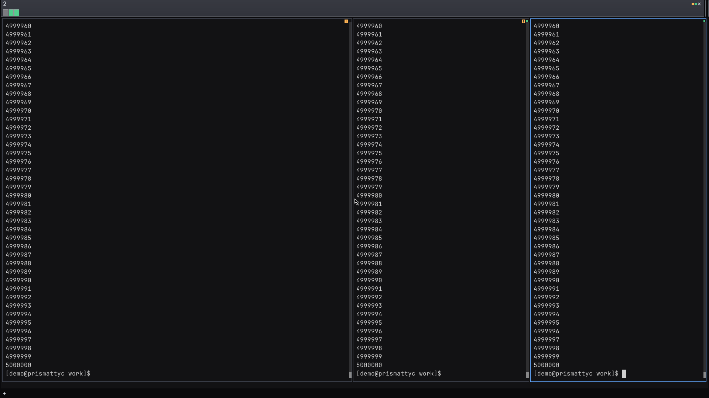
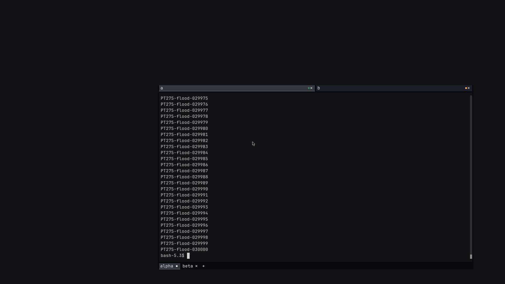

# Bound per-frame scroll damage (PT-275)

A fast producer could append one scroll record per line until the host consumed
a frame. This was a defect introduced by the PT-242 damage model in
[PR #261](https://github.com/brandanmajeske/Prismattyc/pull/261), release 0.1.236.
It was a regression introduced by the render epic. PT-263's faster compact-cell
prototype exposed a larger peak from the same unbounded list.

## Attribute the peak

The matched three-pane flood used `seq 1 5000000` in each attach pane, the same
font set, and pane grids of 92 by 42, 45 by 42, and 45 by 42 cells. The baseline
was `37be3ed` (0.1.254, 80-byte cells). The unfixed compact-cell prototype was
`c2843bc` (36-byte cells). Neither arm bounded the damage list.

Both complete heaptrack traces were cut immediately after their first maximum
RSS record. `heaptrack_print` then exported the allocations live at that point.
The trace peaks are 331.953 and 511.801 MiB. They differ slightly from procfs
high-water values of 329.543 and 511.648 MiB.

| Live allocation at the trace RSS peak | Baseline, MiB | Unfixed compact cells, MiB |
| --- | ---: | ---: |
| Scroll-event vector | 72.000 | 576.000 |
| Retained row cells | 138.858 | 62.485 |
| Initial fonts | 60.889 | 60.889 |
| Attach reader and queue | 0.314 | 1.136 |
| Resize allocations | 0.583 | 0.978 |

The dominant stack is `App::pump` → `MuxRuntime::drain_all` →
`PaneRuntime::feed_replica` → `Emulator::feed` → `Screen::line_feed` →
`GridDamage::push_scroll` → `RawVec::grow_one`. Vector capacity rises from
75,497,472 to 603,979,776 bytes. Allocated capacity can exceed resident pages;
these heap values must not be added to RSS.

The attach-reader queue hypothesis is not supported at these peaks. Neither
row-buffer coexistence during resize nor byte-budget eviction causes the peak.
The full traces and maximum-RSS prefixes remain in the measurement cache.
[The attribution record](assets/pt275-peak-attribution.json) preserves exact
heads, timestamps, allocator stacks, byte counts, and trace hashes.

## Consume bounded damage

This contract was agreed with the PT-243 paint owner, kiro-pc, and copied to
fable-pc before implementation review.

1. Preserve the first 256 scroll events in each frame exactly.
2. On the 257th event, discard the event vector and mark every viewport row
   and cell dirty. Set `GridDamage::scroll_overflowed()` to `true`.
3. Keep that full dirty state for later events. Do not append more records.
4. Treat overflow as a normal full-viewport repaint. Consumers may use the
   marker to report the full-repaint reason.
5. Call `take` after consuming the damage. The returned value keeps its full
   dirty state and overflow marker. The replacement accumulator is empty.
6. On resize, start full dirty damage at the new geometry with overflow false.

The event vector retains at most 256 records, or 6144 bytes on x86_64, and
releases its allocation on overflow. Small batches keep the scroll optimization.
A separate saturating retired-row count includes events discarded by overflow.
`Screen::apply_damage` uses it for cluster-cache reclamation. Dropping scroll
optimization records must not hide row retirement from that collector.
The overflow copy also transfers row wrap flags, since discarded row moves
can no longer carry those flags into the replica.

## Check the boundaries

Core tests exercise the exact 256/257 boundary, 50,000 more events without a
frame, full dirty rows and cells, allocation release, and reset through both
`take` and resize. A separate test verifies that overflow still retires unused
cluster entries in a replica.

The emulator regression feeds 50,000 lines without taking damage, then compares
the complete replica grid with the source. It includes combining marks, CJK,
and flags. Other cases cover mixed scrolling regions, alternate buffers, styles,
and a later ordinary incremental frame. The real-shell box step emits 30,000
numbered lines and asserts a complete final viewport after five seconds idle.

## Verify the fix with unchanged cell size

A third run uses the fixed damage model at `d7a51ab`, still with 80-byte cells.
It repeats the same three-pane 5M-line flood, container limits, fonts, geometry,
profiler, and two-minute final idle. All three completion files are present.
The final screenshot shows line 5,000,000 and the shell prompt in every pane.

| Measure | Unfixed 80-byte cells | Fixed 80-byte cells |
| --- | ---: | ---: |
| Host high-water RSS, MiB | 329.543 | 244.359 |
| Host final idle RSS, MiB | 280.027 | 243.492 |
| Final tracked retained heap, MiB | 202.074 | 202.122 |
| Final retained row cell buffers, MiB | 138.855 | 138.855 |
| Damage allocations at the trace RSS peak, bytes | 75,498,464 | 992 |

Bounding damage alone removes the large scroll-vector allocation at the peak.
The retained row allocation is unchanged. At the fixed trace peak, attach-reader
allocations are 11.631 MiB; they remain outside this fix. Peak and final RSS can
still depend on queues, allocator retention, and workload timing. This is one
controlled run with heaptrack overhead, not a general process-RSS limit.

[The fixed flood record](assets/pt275-fixed-flood.json) includes procfs samples,
completion and geometry records, allocation summaries, and executable and trace
hashes. The later row-wrap replication correction changes `apply_damage`, which
this host flood path does not call. It does not change the measured scroll
accumulator. The final gates cover that correction too.

The final debug box uses `4111fa2` and passes 37 checks, including the new
30,000-line viewport check. Termwright passes all six scenarios. Nine PNGs
are byte-identical to the inspected PT-273 captures; the changed backspace
image was opened and inspected. The box's fast-producer and both inherited
resize captures were also opened and inspected.

