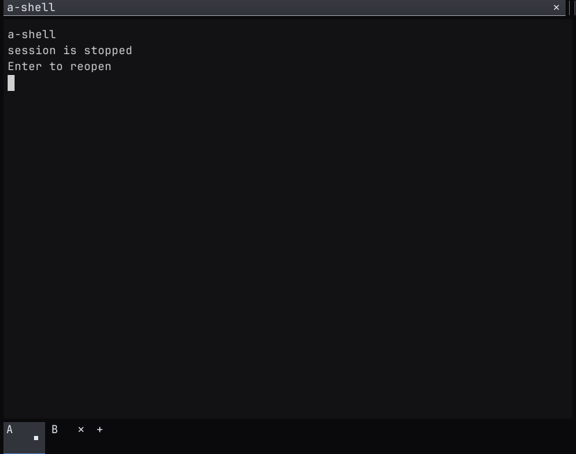
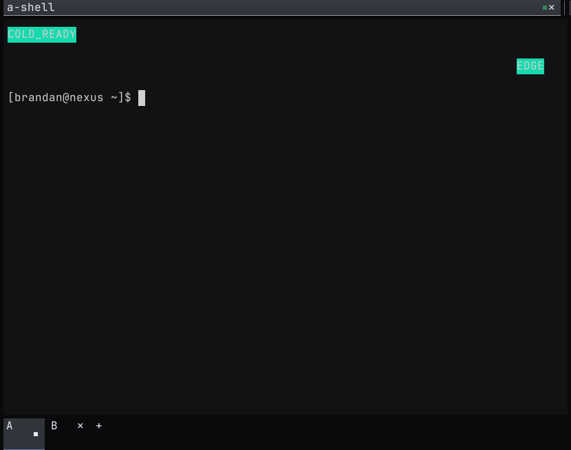
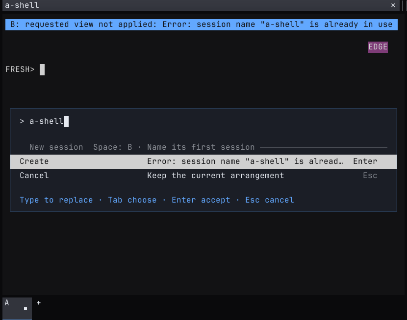

# Recover Spaces after a restart

The September 11, 2026 report showed unusable panes after a restart and
`Work: requested view not applied: pmux exited exit status: 1`.
Investigation against version 0.1.306 found several independent failures.

## Failures and corrections

| Trigger | Failure | Correction |
| --- | --- | --- |
| Create a Space with an existing session name | The helper rejects the name. The host hides the reason, closes the editor, and fences later persistence of the current view. | Capture a bounded helper diagnostic. Keep the entry editable. Preserve the current view when validation fails before a cache write. |
| Restore after `pmuxd` restarts | The cache contains numeric session IDs from the previous daemon. Missing sessions disappear during refresh. A reused ID can select an unrelated session. | Persist stable names and Space ownership. Resolve them before subscribing. Recover older caches from the saved Space. Keep stopped sessions as named placeholders. |
| Attach while assembling a layout | A temporary split creates a narrow emulator. If the final requested size equals the daemon size, the daemon sends no resize event. Output wraps at the temporary width. | Initialize the replica with the server pane geometry before it consumes log events. |
| Press Ctrl+A in the Space name editor | Global shortcut handling dismisses the editor. Subsequent text can reach the shell. | Route editor keys before global shortcuts. Keep selection and paste inside the editor. |
| Create or reopen with no daemon | The helper requires an existing socket. The desktop window cannot start the requested work. | Start the selected daemon on explicit create, open, or session reopen. Honor an explicit private socket even when another default daemon exists. |

Restore alone does not execute saved commands. A stopped session shows
**Enter to reopen**. Enter recreates only the selected saved session.
Ownership checks reject a foreign session with the same name. A deleted
or replaced Space produces an error and leaves the fresh window usable.

## Reproduce and verify

Run the [native restart fixture](../../demo/restart-spaces-e2e.py) with
the binaries under test on `PATH`. See the
[host UX test instructions](../../demo/README.md#run-host-ux-regression-checks)
for dependencies and output paths.

The fixture owns its display, daemon, home, and XDG directories. It tests:

1. Create from a desktop window without a daemon.
2. Reject a duplicate name and retry in the same dialog.
3. Restart only the window and retain the original PTYs and input routing.
4. Restart the daemon, reuse an old ID for an unrelated session, and reopen
   only the intended saved session.
5. Create another Space after recovery.
6. Recover an older cache that lacks stable identity metadata.
7. Restore without a daemon, then start it with Enter.
8. Create a Space after restoration of a deleted Space fails.

Each output probe requires an executed shell marker and a distinct color
in both the presented frame and an X11 display capture. A probe near the
right edge detects the temporary-width failure. Identity checks cover
session IDs, pane IDs, child PIDs, ownership, and unrelated-session input.
The result includes binary hashes. Missing completion markers or failed
results fail the integrated host UX runner.

## Evidence limits

The live journal confirmed duplicate session names behind the reported
exit status. A controlled daemon restart reproduced the stale-ID failure
on version 0.1.306. A controlled window-only restart preserved its PTY.
The original saved Space files were absent by the time they were
inspected, so the exact sequence behind every pane in the screenshot
could not be reconstructed.

The fix has local workspace, Termwright, and native X11 coverage. These
checks do not establish behavior on macOS or Wayland. Local Actions merge
gates remain separate. Do not infer a release verdict from this report.

## Native captures

The following captures use the version 0.1.307 candidate. The fixture
also checks the actual X11 display.

