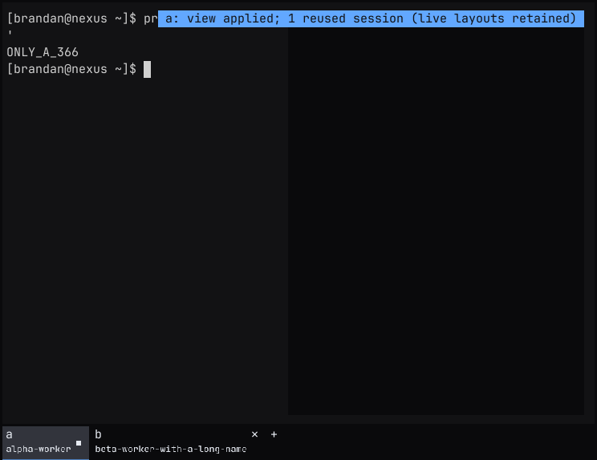
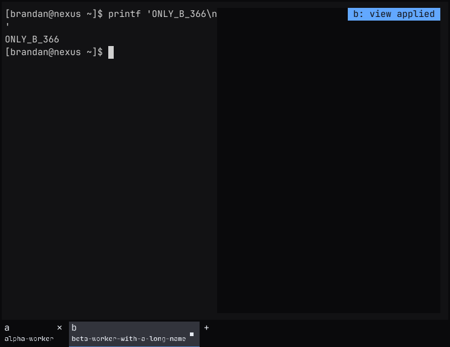
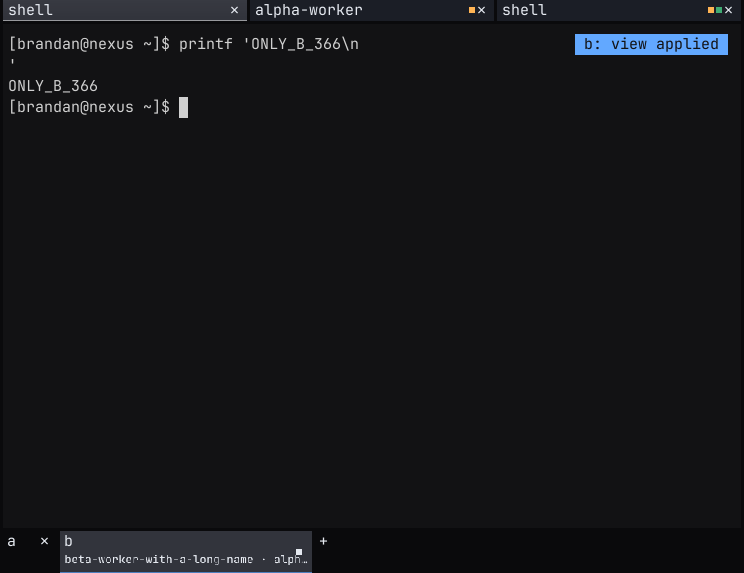
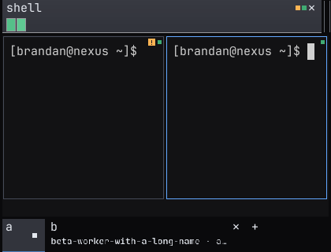
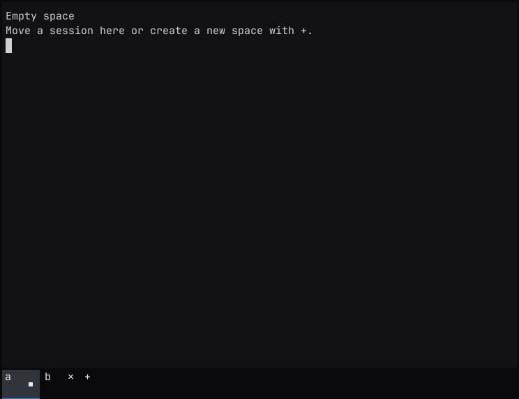
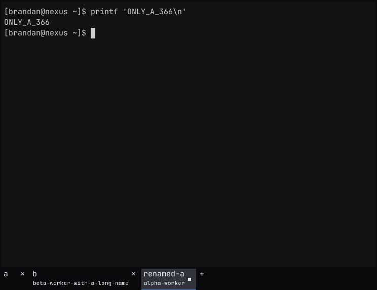

# Review exclusive Spaces in 0.1.304

The runtime head is `948d7f5c2c419a434ca70be6beec7fbc5b019a5e`.
This change addresses [issue #366](https://github.com/brandanmajeske/Prismattyc/issues/366).
The operator must approve the merge. The live desktop was not restarted or installed.

## Results

| Check | Result |
| --- | --- |
| `cargo fmt --all --check` and `git diff --check` | Pass. |
| `cargo clippy --workspace --all-targets --locked -j2 -- -D warnings` | Pass on the runtime head. |
| `env -u PRISMATTYC_HOST cargo test -p prismattyc-mux --locked -j2` | Pass. 724 tests, including 70 CLI integration tests. Mux sources are unchanged from tested head `73266cdb`. |
| `cargo test -p prismattyc-host --locked -j2 space_ -- --test-threads=1` | Pass on the runtime head. 59 tests, including the private display fixture and rail raster checks. |
| `./scripts/termwright-e2e.sh` | Six scenarios pass. Ten PNGs inspected. The later rename and help changes do not modify this nested classic binary. |
| Negative controls | Removing the window target, initial ownership check, or stable-ID rename check makes the relevant window fixture fail. Restoring each check passes. |
| Version stamp | `0.1.303` on `origin/main` to `0.1.304`. |

The mux command removes the enclosing host marker. With `PRISMATTYC_HOST=1`,
two standalone attach fixtures expect the wrong scroll chrome. The complete
suite passes with that variable removed. No production change was needed.

[The validation receipt](../assets/spaces-366-validation.json) records log
hashes, source heads, negative controls, and screenshot names.

## Reproduce the window fixture

Build the daemon and CLI from the same checkout before the test.
The fixture supplies a private display, socket, configuration, and data directory.

```bash
cargo build -p prismattyc-mux --bin pmux --bin pmuxd --bin pmux-attach --locked -j2
cargo test -p prismattyc-host --locked -j2 \
  space_open_window_tests::isolated_space_windows_create_move_and_render \
  -- --exact --nocapture --test-threads=1
```

The fixture checks distinct session and process IDs, isolated output markers,
fresh Create/Split/New Tab actions, queued Space switches, pane and session
moves, empty views, named-pane exit, rename followers, reuse of the old name,
and handoff of the shared CLI target after its primary window closes.
A move must retain the original pane and process IDs.

## Inspect the rendered result

Separate Spaces show separate terminal output:





The destination has three sessions after the moves. Live pane names use the
smaller second line of the Space chip. Long names stay within the chip.
Set `space_rail_pane_names = false` at the top level of the host config file to hide this second line.





Opening an empty Space does not spawn a replacement shell:



A second window follows a renamed Space by identity. Reusing the old name
for a fresh Space does not change that window's process or output:



## Deferred checks

CRAP and cargo-mutants are deferred at the operator's request until functional
review is satisfactory. No mutation score or CRAP result is claimed.
The full workspace test and Local Actions batch are not claimed. Exhaustive
interruption and concurrency validation remains part of later hardening.
The [ownership contract](spaces-exclusive-ownership.md) lists the complete
requirements; its fixture table is not a completed-test ledger.
