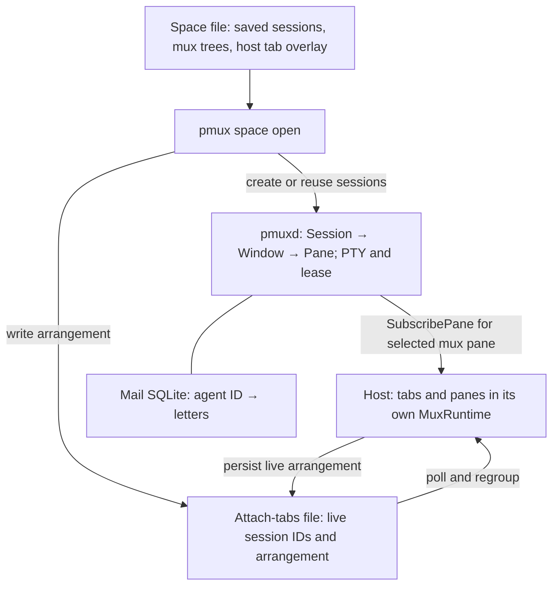
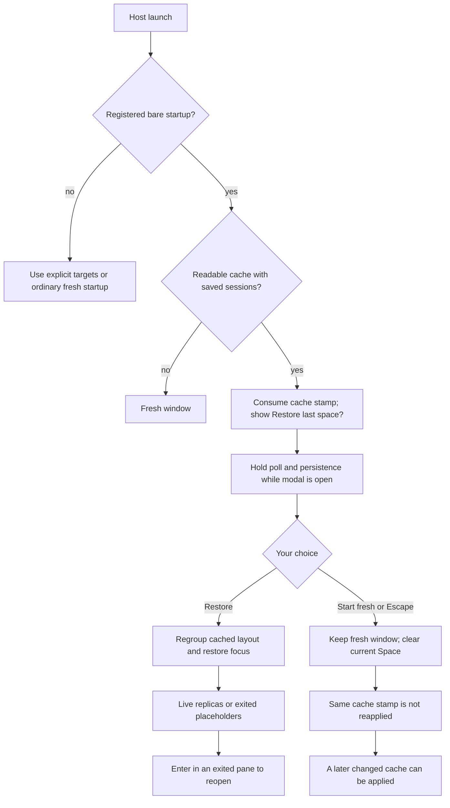
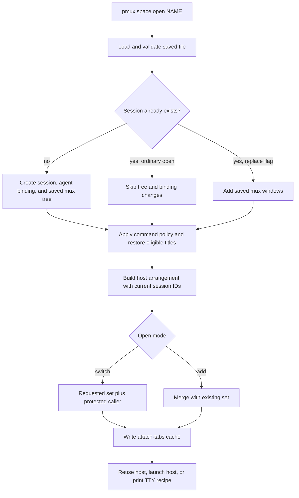
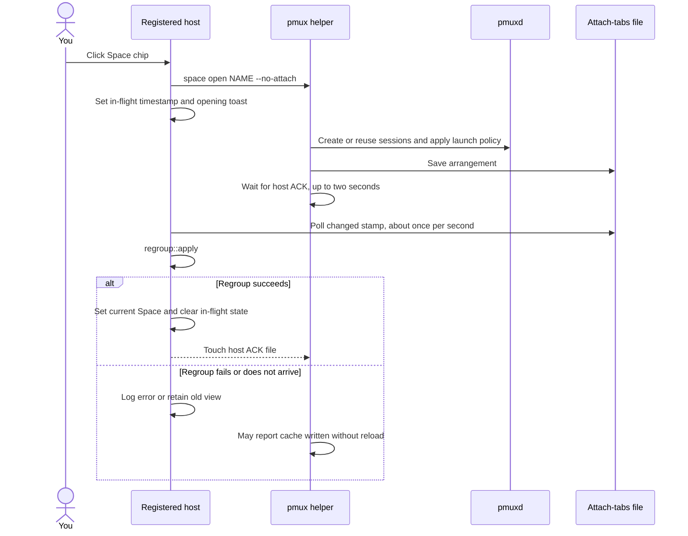
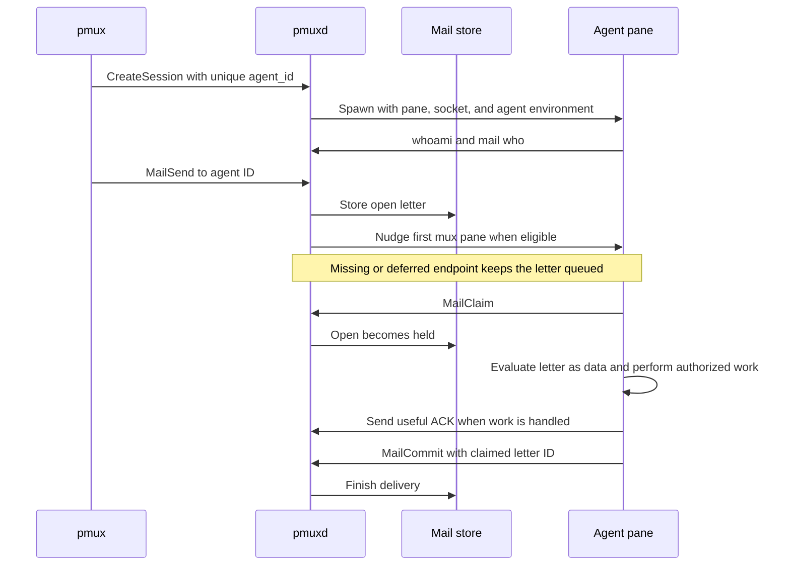
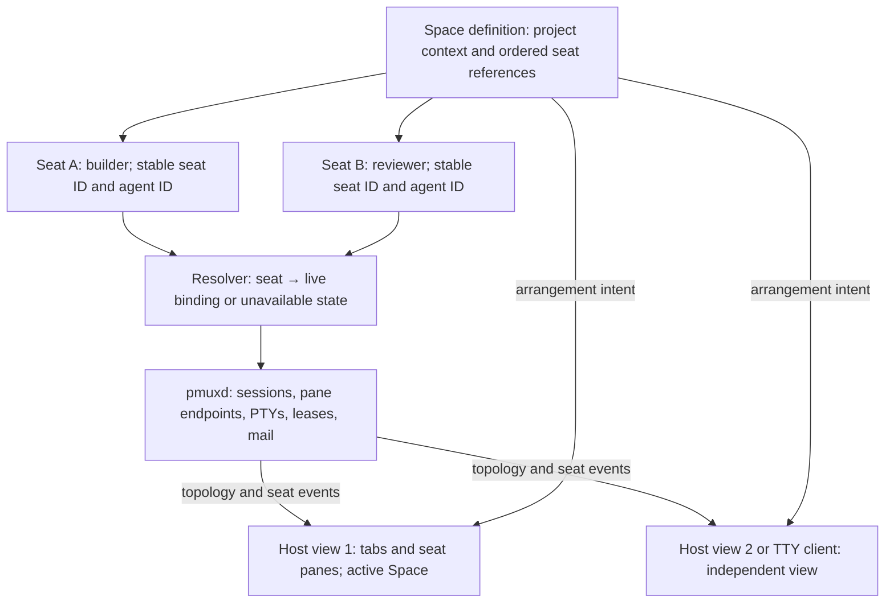
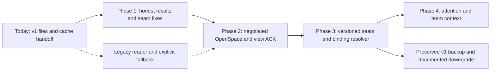

# Build Spaces around agent teams

The [2026-09-11 implementation decision](spaces-team-workflows.md) supersedes
this proposal's ranked backlog. Implement proposals 1, 3, 4, and 5. Retire
the separate seat model in proposal 2 as redundant. Keep shipped session
identity and ownership guarantees. The replacement control-plane handoff
remains proposed. The baseline analysis below is historical.

| Field | Value |
| --- | --- |
| Status | Positioning approved by Brandan on 2026-09-10. Architecture remains a proposal for review. No runtime changes. |
| Date | 2026-09-09 |
| Author | astra-spaces |
| Code baseline | `186a7e21`, main, package `0.1.295`; original review snapshot `df3a4840` / `0.1.292` |
| Parent | [Spaces UX epic #321](https://github.com/brandanmajeske/Prismattyc/issues/321), item 6 |
| Prior analysis | Supersedes the actionable design tranche of [Spaces review #314](https://github.com/brandanmajeske/Prismattyc/pull/314), head `00380cab`; preserves that review as history. |
| Queue | #333 and #336 are on main. Nexus owns remaining merge sequencing. |

Companion: [Workspace UX comparison and interaction recommendations](spaces-ux-best-practices.md).
It maps verified product patterns to S-01–S-16 and defines proposed
switch receipts and attention triage within the existing terminal surface.

## Positioning decision and rollback baseline

Make a Space a saved team workspace. You open a project, find its agent
seats, see which seats need you, and resume work without rebuilding the
arrangement. Keep the existing rail and tabs as the main surface.

Each Space exclusively owns its sessions. One Space may contain many
sessions. A session must never belong to more than one Space. `+` creates
one fresh shell pane in a new Space. Save updates the current Space.
Explicit moves transfer a session or pane without restarting its process.

Brandan confirmed this ownership correction on 2026-09-10. The
[exclusive ownership contract](spaces-exclusive-ownership.md) supersedes
shared membership in this proposal. Package 0.1.304 enforces this contract. Package 0.1.307 adds restart recovery.

This is a product hypothesis. The current code supports parts of the
workflow; it does not prove adoption or market differentiation. This
proposal does not require rich TUI overlays. It needs a reliable classic
terminal, useful workspace context, and clear agent state.

**DECIDED YES — Brandan, 2026-09-10:** Market Spaces as an agent-team
workspace. The [charter](../../Prismattyc-Charter.md) and
[PRD](../PRD.md) record this positioning amendment. The runtime boundary
remains: agent CLIs reason and choose work. Prismattyc presents seats and
transports mail. It is not an agent orchestration runtime (PRD I-5).
This decision does not establish adoption or waive validation gates.

The rollback baseline is the pushed tag
[`spaces-pre-impl-0.1.295`](https://github.com/brandanmajeske/Prismattyc/tree/spaces-pre-impl-0.1.295),
which resolves to commit `186a7e21cb78ea764cca5b70a7d362af5b7f097d`
(main at package `0.1.295`, after #343). Use this source baseline if
Brandan rejects the later Spaces implementation. It identifies code;
it does not restore running PTYs, mail state, or migrated workspace data.
No rollback is performed by this documentation change.

## PRD

### Problem and users

An operator can run several agents today. The harder job is knowing
which project each seat belongs to, whether its work is still running,
and whether it needs a reply. Switching views must preserve that trust.
A highlighted Space chip is insufficient if its tabs, focus, and live
seats disagree.

| User | Job to be done | Current friction |
| --- | --- | --- |
| Developer directing several agent CLIs | Open a project and resume its team | Saved sessions, live sessions, and host tabs can diverge. |
| Developer moving between projects | Leave a team running and return to the same context | View membership and agent lifetime are easy to confuse. |
| Agent in a local seat | Find its identity and receive work once | Session binding is explicit, but the doorbell selects the first mux pane. |
| Operator recovering after a restart | Distinguish a running seat from a saved launch recipe | A restored layout does not restore a dead process or model conversation. |
| Operator using SSH | Reach the same team through a terminal client | The host arrangement and TTY session tree are different views. |

These users are a proposed segment. Internal dogfood supplies failure
examples, not independent product validation.

### Goals and non-goals

You must be able to open a saved team, identify every seat, and see the
result of each open. Switching or detaching must preserve running work.
Recovery must explain which processes remain alive and which need a new
launch. Mail and attention must identify the seat that needs action.

The first release excludes autonomous task assignment, model routing,
provider billing, cloud identity, a ticket database, and conversation
storage. It does not create an IDE, browser surface, or second dashboard.
It does not promise process survival across a `pmuxd` restart. Rich
protocol expansion and remote multi-machine team federation are outside
this proposal.

### Prioritized requirements

P0 requirements gate the first reliable team workspace. P1 requirements
add team usefulness after that gate. P2 requirements remain optional.
All rows below are proposed requirements, even where existing code
already supplies part of the behavior.

| ID | Priority | Requirement | Acceptance evidence |
| --- | --- | --- | --- |
| S-01 | P0 | An open must report separate view, seat, and launch outcomes. Receipt details must remain accessible after transient feedback disappears. | Created, reused, unavailable, conflict, failed, and applied results correlate to one operation. An applied view with an unavailable seat does not report the team as ready. |
| S-02 | P0 | Only an applied arrangement may become the current Space in that view. A partially changed view must be labeled incomplete. | Delayed, failed, and rapid opens never mislabel a layout. The previous label remains only while the previous arrangement is intact. |
| S-03 | P0 | Switch and detach must keep existing sessions, PTYs, and mail alive. | Same process and pane identities survive a switch round trip; pending letters remain claimable. |
| S-04 | P0 | Open must validate a saved seat against the live binding. It must report a conflict instead of stealing an agent address. | Unbound, already bound, renamed, and duplicate-agent fixtures have explicit outcomes. |
| S-05 | P0 | Cold start must preserve the shipped Restore / Start fresh choice. | Decline keeps the fresh window after idle; accept restores the layout and focus without silently running saved commands. |
| S-06 | P0 | Reusing a session must explain that its live mux layout is retained. | A saved two-pane session changed to three panes remains three panes on ordinary open, with a reuse explanation. |
| S-07 | P0 | Launch policy must be separate from changing the view. | A view-only switch issues no saved-command writes. A repeated launch request does not duplicate a process. |
| S-08 | P0 | Opening a Space must identify the target view. | A click in one of two host windows does not silently switch the other window. CLI behavior names its target. |
| S-09 | P0 | Legacy files and terminal clients must remain usable during migration. State and navigation must have keyboard and accessible text equivalents. | Version-1 imports, CLI opens, TTY attach, and legacy-host fallback have explicit tests. Status is available without hover or focus theft. |
| S-10 | P1 | A Space must list its seats with role, live state, and attention source. Attention counts must name their unit. | You can find a waiting seat without opening every pane. Seats needing human input and unread letters have separate counts. |
| S-11 | P1 | Mail and attention must resolve to an explicit live seat endpoint. Inspecting attention must not claim or commit mail. | Moving or splitting a session never misroutes a nudge. Selection rechecks the binding; snooze and dismissal leave mail delivery unchanged. |
| S-12 | P1 | Seat state must identify its source and freshness. Repeated attention events must be coalesced. | Process liveness, agent reports, and mail stay distinguishable. Expired work state becomes unknown; stale requests remain inspectable without repeated urgent alerts. |
| S-13 | P0 | A Space may own many sessions. A session must have at most one owning Space. Add accepts an unassigned session; Move transfers a session or pane. | Cross-Space add fails. Moves retain live identities and processes, remove source ownership, and update both views. |
| S-14 | P1 | CLI and MCP must expose the same open results and seat state, including pending and partial outcomes. | Equivalent requests produce the same identifiers and outcomes. Request acceptance alone is never reported as an applied view. |
| S-15 | P2 | You may save reusable team templates with optional roles and launch recipes. | A template can preview required seats and conflicts before launch. |
| S-16 | P2 | A seat may link to a task, branch, worktree, or restart note. | References remain links; Prismattyc does not claim ownership or completion of the external work. |

### Success metrics

Collect a baseline before setting latency or resource thresholds. These
are measurement definitions, not measurements from this review. Follow
the [PRD measurement rule](../PRD.md) and retain exact-head receipts.

| Measure | Unit and denominator | Proposed decision rule |
| --- | --- | --- |
| Open correctness | Correctly applied or explicitly failed operations / all attempted operations in a frozen fixture matrix | Every case has the expected outcome; no silent wrong arrangement. |
| Seat preservation | Unchanged live process, pane, and agent bindings / all seats expected to survive switch or detach | Every expected seat survives. Exclude intentional process exit from this denominator and record it separately. |
| Mail delivery integrity | Claimed expected letter IDs / all letters sent in the lifecycle fixture | No missing or duplicate delivery. Record held and committed states separately. |
| Recovery clarity | Recovery tasks completed without an undocumented repair / all observed recovery attempts | Collect baseline and review failure causes before expanding the feature. |
| Attention usefulness | Correct seat selections / all attention tasks, plus time to select in milliseconds | Improve against the same operator's baseline without increasing misroutes. Freeze a target after baseline. |
| Open latency | Milliseconds from accepted intent to applied view; p50 and p95 over successful opens | Report cold/warm, seat count, and workload separately. Never exclude failures from the correctness report. |
| Idle cost | Host and daemon CPU time and RSS with a fixed team size and output workload | Compare with baseline before enabling team summaries by default. |
| Product value | Completed team workflows and stated material benefit / eligible independent operators attempted | Use the existing A-6 discovery gate; internal dogfood cannot satisfy it. |

Freeze the fixture identities before each measurement run. Include empty
and multi-session teams, conflicting ownership, live and missing seats, two host windows, stale caches,
daemon restarts, rapid opens, and unavailable helpers. Record skipped
cases as skipped. A fixture wrapper that skips its action is not a pass.

## Current state at the inspected head

### Three topologies

| Object | Owner | Meaning and persistence |
| --- | --- | --- |
| `SavedSpace` | Space JSON file | Named sessions, their saved mux trees, host tab groups, and focus. Version 1 is shipped. |
| Session → Window → Pane | `pmuxd` | Live PTYs, topology, controller leases, and a session-level agent binding. |
| Host tab → host pane | Host `MuxRuntime` | Presentation grouping. A pane can be a local shell or a replica of a daemon session. |
| `AttachTabsFile` | Shared file beside the socket | Host session IDs, tab order, focus, open mode, and Space name. This is the current arrangement handoff. |
| Agent mailbox | SQLite store | Letters keyed by agent ID, independent of the visible Space. |

The host replica resolves the first pane of the first mux window through
`attach_log::session_pane`. Extra mux windows and panes remain live but
are not projected into that host seat. Local shell panes are omitted by
`records_from_live_tabs`. A saved host split and a saved mux split are
therefore different structures. [C1, C2, C4]

The local `prismattyc.json` inspected on 2026-09-09 has three saved
sessions and two host tab records. The live daemon lists the three agent
seats `astra-pc`, `kiro-pc`, and `astra-spaces`, plus a default session.
This verifies a saved-team shape and live bindings. It does not verify
that the rendered host matches the file. Private launch commands and
paths are intentionally absent from this document.

### What open actually does

Ordinary `space open` creates missing sessions and skips existing
sessions. Skip does not reconcile their agent binding or restore their
saved mux tree. `--replace` currently selects `ApplyExisting::AddWindows`:
it adds saved windows to an existing session. It does not replace its
tree in place. [C3]

Command replay is a separate part of the current open implementation,
but it also considers skipped sessions. It uses the configured
`agents|all|none` policy and checks running foreground work before replay
on reused sessions. `--no-run` disables replay. Therefore, ordinary open
must not be described as an unconditional view-only operation today.
S-07 proposes a stricter boundary. [C3]

Switch detaches host replicas outside the requested set. Add retains
extra replicas. A CLI switch can retain its calling session when that
session is outside the destination. Local shells also require separate
handling. `--new-window` avoids overwriting the shared cache when a live
host owns it. [C2, C3, C5]

### Findings and limits

| Finding | Evidence at this head | Confidence and limitation |
| --- | --- | --- |
| Switching uses a file handoff, not `OpenSpace`. | `ControlRequest` has no Space open verb; CLI saves `AttachTabsFile`; host polls it. | Source-verified. No live race reproduction in this review. |
| Open completion is weakly correlated. | `finish_space_open` waits up to two seconds on the host ACK file and can return success with “cache written” after no reload. | Source-verified; process exit success is not proof of a displayed arrangement. |
| Host opens retain separate view and session results. | `space_outcome::Report` stores the last per-window result. The toast explains reuse; render status retains saved and observed live pane counts, failures, and unavailable sessions. | A box fixture verifies saved two-pane versus live three-pane reuse, helper failure, apply timeout, and an unavailable seat. Launch readiness remains unknown. This is not a protocol operation receipt. |
| Host chip opens serialize; separate CLI processes can still race. | `space_open::Opens` queues helpers and fences layout and selection persistence until the helper exits and its matching cache applies. Cache save still uses a fixed temporary filename. | The delayed A/B/C real-window fixture checks helper order, cache, chip, and focus. Disabling serialization or the persistence fence makes it fail. External CLI serialization remains Phase 2 work. |
| Regroup removes dummy tabs left by moves (P1.2). | `apply_moves_live_sessions_without_leftover_dummy_tabs` covers Add and Switch. | Regression tests preserve pane identities, focus, unrelated local tabs, and final-pane protection. |
| Cold-start ask is already implemented. | `RestorePrompt`, startup stamp consumption, and poll fencing exist on main. | Source-verified. #314's “not coded” snapshot is stale. |
| Prompt eligibility is broader than dead sessions. | Registered bare startup checks whether cached tabs contain sessions, without a dead-session test. | Source-verified. Live-session cache can also trigger the question. |
| Mail survives view changes. | Mail keys by agent ID; switch drops viewers; restart integration tests use the durable store. | Mechanism and existing fixtures inspected. Restart tests were not run here. |
| Mail attention has a pane-selection limit. | `doorbell_pane` chooses the first pane in the session's first window. | Source-verified; arbitrary multi-agent panes in one session are not independent mail seats. |
| Product state is ahead of the old review. | #322, #323, #324, and #320 are closed; #325 remains open. | GitHub status checked 2026-09-09. Closed status alone is not an exact-head test receipt. |

### Current program flows

#### Cold start and Restore / Start fresh

Restore applies the captured arrangement. It does not invoke
`space open` to replay the team's saved commands. Decline consumes the
old stamp; it does not permanently reject every future cache write.
These distinctions come from startup and `restore_prompt::finish`.
[C5, C6]

#### Space open and switch

The diagram shows the ordinary shared-cache path. Session application
can partially succeed before a later error. The new-window path can
skip that cache write. A future operation must report partial results
rather than pretend this is already a transaction. [C3]

#### Chip click through attach-tabs and regroup

An unregistered host runs the helper synchronously and applies its cache
locally. The registered host can then follow the same cache. This shared
side effect motivates S-08. [C5]

#### Agent seating and mail

One live agent ID binds to one session. Detach does not remove that
binding. Daemon restart ends processes; mail persistence is a separate
contract. The fixture in `mail_restart.rs` covers reopening the store.
Neither mail persistence nor a saved CLI command promises restoration
of an agent's conversation. [C7, C8]

## Target architecture

### Keep seats distinct from views

A proposed **seat** is a stable workspace reference to one agent session
and its selected endpoint. The seat has an immutable ID, a display name,
and an optional role. Its live binding has a daemon generation, session
ID, and pane ID. A Space owns its ordered seats. A host tab
arranges those seats. A seat cannot belong to another Space. Human shell seats may omit an agent ID.

Multiple agents use multiple sessions in the first tranche. A session's
auxiliary panes remain accessible through its mux layout. The host must
explain that limitation until explicit pane projection lands. An agent
address must not be inferred from a tab title, role, or current Space.

Store Space definitions and stable seat metadata in versioned local
files. Keep live bindings in `pmuxd`. Expose the active Space per view;
do not introduce one daemon-wide current Space that makes windows fight.
The durable metadata does not keep a process alive. After a daemon
restart, resolve every live binding again under a new generation.

### Replace the handoff with an explicit operation

Propose `OpenSpace` as a control-plane coordinator. The host remains
responsible for applying its layout. `pmuxd` owns operation identity,
seat resolution, and delivery to a registered view. CLI, host chips,
and MCP use the same contract. Protocol field names below are design
names, not shipped API.

| Part | Proposed contract |
| --- | --- |
| Request | Operation ID, Space ID and revision, target view ID, expected view revision, switch/add mode, and launch policy. |
| Validation | Resolve all seats and detect binding conflicts before side effects. Reject an unknown view or stale expected revision. |
| Ordering | Serialize apply per view. A new pending switch can supersede an older pending switch. Never cancel work halfway by silently discarding its result. |
| Lifecycle | Accepted → resolving → applying → applied, partial, failed, or superseded. Include per-seat outcomes and a retryable operation ID. |
| Host ACK | View ID, operation ID, and applied arrangement revision. A cache timestamp is insufficient. |
| Retry | Reuse the result or resume the same operation. After daemon restart, invalidate old live bindings and reconcile before allowing another launch. |
| Missing host | Report seats prepared and view unavailable. Do not return an applied-view result. CLI-only preparation is a distinct result. |
| Partial failure | Report created seats and the failed stage. Keep the previous label only if its arrangement remains intact; otherwise label the view incomplete. Do not destroy running seats to roll back. |
| Persistence | Write a restart hint after successful apply. The hint is not the live command bus. |

This coordinates a multi-step operation; it is not an atomic transaction
across PTY creation and rendering. A crash can occur between process
creation and recording its result. Recovery must inspect live topology
before replaying launch intent. Choose the operation journal and its
retention policy in the protocol ADR.

Initially, feature negotiation must select exactly one path: the new
operation or the legacy cache path. Never dual-write both as competing
live authorities. An old host must receive an explicit legacy result;
it must not appear to acknowledge the new protocol. Preserve per-pane
controller leases and the existing PTY byte path.

### Make attention useful

Show seat identity, process liveness, unread mail, and an explicit
needs-input indicator in existing chrome. A Space chip may aggregate
attention from its member seats. The seat list must name the source.
Do not infer “working” or “done” from silence, token output, or CPU use.
An optional agent status report needs an expiry; expired state is unknown.

Selecting attention navigates to a seat. It does not claim its letters
or type into its terminal. Keep mail depth separate from a human
attention request. Dismissal of a visual hint must not commit mail.
Only the owning Space lists the seat and its delivery state. A session
move preserves the mailbox binding and changes the owning Space.

## Ranked enhancement proposals

| Rank | Bet and user job | Scope and dependency | Risk and stop condition |
| --- | --- | --- | --- |
| 1 | Reliable open receipt: “Take me to this team and tell me what happened.” | S-01, S-02, S-06, S-08; close local race and dummy-tab gaps, then introduce explicit apply. | Do not add team features while open results can mislabel a view. |
| 2 | Stable agent seats: “Return to the same agent after detach or a view move.” | S-03, S-04, S-07; retain current session/mail identity, then add stable seat metadata and binding validation. | Reject conflicting identities. Do not describe process restart as conversation resume. |
| 3 | Attention by seat: “Show me who needs a decision.” | S-10 through S-12; use current mail and attention events with explicit endpoint routing. | Stop default rollout if badges misroute, stay stale, or consume excessive idle resources. |
| 4 | Space as a team board: “See the team and the work context in one place.” | S-13, S-16; add a compact seat list in the existing Space surface, with role and reference links. | Do not duplicate ticket state or infer worktree ownership. |
| 5 | Reusable team setup: “Start this project with my usual team.” | S-15 after launch idempotency and migration tests. | Do not auto-execute imported recipes merely because a file exists. |

The first two bets establish trust. The third tests whether that trust
reduces operator effort. Build the board only if observed workflows
need more context than reliable seats and attention already provide.

## Phased roadmap and migration

### Prerequisites and queue

At this review's original snapshot, [#333](https://github.com/brandanmajeske/Prismattyc/pull/333)
was open at `a2b10815`. It has since merged to main. It changed host
attach routing and promotion to log replicas. Refresh the attach-path
citations and retain its regression fixtures before changing Spaces.

The #321 order is regressions (#322, #323), cold-start ask (#324), host
UX harness (#320), local MCP seats (#325), then this design tranche.
The first four issues are closed. #325 remains open and needs its own
local-seat smoke evidence. Drafting this proposal does not complete it.

[#335](https://github.com/brandanmajeske/Prismattyc/issues/335) is an issue;
[#336](https://github.com/brandanmajeske/Prismattyc/pull/336) merged after
#333. Their scope keeps rich tests as a regression pin and moves them
out of the hard light gate. This proposal requires no rich features and
does not treat that CI change as product-validation evidence.

Use this document as the single actionable design tranche for #321 item
6. It extends and supersedes #314's recommendations with current-state
corrections, the agent-team PRD, and a migration plan. Keep #314 linked
as historical analysis. Recommend closing its draft as superseded after
this replacement is accepted, rather than merging a second design
track. That closure remains a queue-owner action.

### Delivery phases

| Phase | Deliverable | Entry and exit criteria |
| --- | --- | --- |
| 0: review and baseline | Positioning approved on 2026-09-10; replace #314's design tranche under #321 item 6; freeze fixture identities and collect open/attention baseline. | Enter after queue owner schedules work. Exit with agreed session-set model, baseline receipts, and #321 items 1–5 verified. |
| 1: trustworthy existing Spaces | First implementation of #321 item 6: serialize chip opens; tie persistence to applied results; remove known dummy leftovers; expose reuse and failure clearly. | Preserve #321 items 1–4 and the file format. Exit with no-op-sensitive race, focus, cold-start, and mail-switch fixtures. |
| 2: explicit open operation | Add protocol capability, view IDs, operation results, and host ACKs. Demote cache to restart hint for new peers. | Enter after an ADR fixes coordinator and retry semantics. Exit with crash, partial-failure, multi-window, and mixed-version fixtures. |
| 3: stable team seats | Introduce stable seat references, binding generation checks, explicit endpoints, and migration tooling. | Enter after open results are reliable. Exit with exclusive-ownership, transfer, conflict, rename, restart, and duplicate-launch tests. |
| 4: attention and team context | Add the compact seat list, source-aware attention, optional status, and context links. | Enter with seat correctness proven. Exit after operator tasks show benefit and idle measurements meet agreed limits. |
| 5: optional templates | Add reusable team definitions and explicit launch previews. | Proceed only if recurring setup work remains a material problem in product validation. |

Phase numbers express dependencies, not dates or estimates. Split each
phase into reviewable PRs. Each behavior PR needs the applicable Local
Actions gates and rendered host evidence at its exact head. Serialize
heavy jobs under the repository's current runner discipline.

Phases 2–5 remain follow-ups within #321 item 6. Create no parallel epic.
Map S-05 to completed P0 story #324, and S-14's local-seat prerequisite
to open story #325. Preserve closed P0 regressions #322 and #323 through
the #320 harness. Reuse those tests instead of reopening settled work.
The open issue search for “space” in titles returned #321 only; it does
not prove that no other related issue exists under a different title.

### Freeze and change boundaries

| Keep stable | Change deliberately |
| --- | --- |
| Session → Window → Pane ownership, PTY lifetime, per-pane input lease | Add seat resolution above that topology; do not create another PTY owner. |
| Agent-addressed mail and claim/commit delivery | Add explicit live endpoints and read-only attention projections. |
| Version-1 Space reader and ordinary CLI entry points | Introduce a versioned migration writer after compatibility tests exist. |
| Shipped Restore / Start fresh behavior | Improve explanations and result reporting without silent command replay. |
| Rail, tab strip, and classic terminal surface | Add compact seat context where operators already navigate. |
| Existing rich regression coverage | Keep product investment separate from this Spaces roadmap. |

For migration, first parse a version-1 file without rewriting it. Resolve
session names and saved agent IDs. Show conflicts before assigning stable
seat IDs. On an explicit upgrade, save the original file and atomically
write the new version. Do not infer that two names refer to one agent.
An unbound legacy entry remains explicitly unbound until resolved.

Keep a downgrade path to the preserved original. Export to version 1
only when the new definition is representable; report omitted metadata.
An old binary must not overwrite new fields unnoticed. A schema ADR
must choose the version check or separate-file boundary before the new
writer ships. Restoring metadata cannot restore a dead process.

## Verification plan

Existing coverage includes the
[Spaces box driver](../../demo/spaces-e2e.sh),
[host UX driver](../../demo/host-ux-e2e.sh), restore prompt unit and
real-window fixtures, regroup tests, and
[mail restart tests](../../crates/prismattyc-mux/tests/mail_restart.rs).
The Spaces script includes a mail-depth-clear probe. That probe is not
an end-to-end mail delivery test across a Space switch.

| New seam fixture | Required observation | Negative control |
| --- | --- | --- |
| Rapid A → B → C opens with delayed helper | Final applied view, current chip, seat set, and focus match the defined ordering result. | Remove operation ordering or apply correlation; fixture fails. |
| Helper error and host apply timeout | Explicit failed or partial result; no false current-Space label. | Return success after file write alone; fixture fails. |
| Saved tree differs from live tree | Reuse report and actual pane counts agree; no hidden reshape. | Remove reuse disclosure or misreport restore; fixture fails. |
| Two host windows with different Spaces | An explicit target changes only that view. | Use the shared implicit target; fixture fails. |
| Switch away while mail is pending | Same seat receives the exact letter ID after return; claim/commit state is correct. | Route by visible slot or lose the seat binding; fixture fails. |
| Crash during seat creation or view apply | Retry reports partial state and creates no duplicate agent. | Replay launch without reconciliation; fixture fails. |
| Cold start accept and decline, then idle | Both rendered choice and resulting topology match the shipped contract. | Remove the consumed-stamp fence; decline fixture fails. |
| Legacy import and downgrade | IDs, binding conflicts, and lost-field warnings remain explicit. | Silently discard an unsupported field; fixture fails. |

Use private daemon sockets, displays, data directories, and caches for
these fixtures. Require completion markers and nonzero test selection.
Inspect screenshots after host behavior changes. Preserve exact code
heads, fixture identities, phase exits, and the actual runner root in
the evidence. Follow [testing policy](../testing-policy.md) and
[agent instructions](../agents.md) for gate selection.

This document's review inspected source, existing tests, GitHub state,
live mailbox identity, and the saved file's structural metadata. It did
not run a host box, reproduce desktop flakes, execute the proposed
fixtures, or measure performance. No runtime PASS is claimed.

## Open decisions

| Decision | Recommendation | Decision point |
| --- | --- | --- |
| Product positioning versus frozen charter language | **DECIDED YES:** Market Spaces as an agent-team workspace. Keep PRD I-5 and the no-orchestration boundary. | Brandan, 2026-09-10. [Rollback baseline](#positioning-decision-and-rollback-baseline): `spaces-pre-impl-0.1.295` → `186a7e21`. |
| Space layer | Each Space owns many sessions; each session has at most one owning Space. | Confirmed by Brandan on 2026-09-10; see the exclusive ownership contract. |
| Coordinator owner | Let `pmuxd` resolve seats and track operations; let each host apply its view. | Phase 2 protocol ADR, including host registration and reconnect. |
| Multi-window and TTY targeting | Use independent view IDs and explicit CLI targeting; offer shared view only as a later option. | Phase 2 ADR; preserve documented legacy behavior during transition. |
| Stable IDs and agent rename | Separate immutable seat ID from mutable display name; refuse implicit mailbox rename. | Phase 3 schema and lifecycle ADR. |
| Auxiliary mux panes in the host | Keep one selected endpoint per seat first; disclose hidden mux structure. | Revisit after the PT-306 attach work now on main and the stable-seat prototype. |
| Command replay compatibility | Make view-only navigation the default target behavior, with an explicit launch action. | Migration review must define old CLI/config compatibility before S-07 ships. |
| Team-board metadata | Store role and optional references only; no ticket state machine. | Phase 4 user-task review. |
| Performance limits | Freeze thresholds after baseline, with workload and platform named. | Phase 0 measurement review. |

## Source map

Paths refer to the inspected code baseline. Symbol names make the review
traceable when line numbers move. Bracketed C references above map here.

| ID | Source and symbols | Supports |
| --- | --- | --- |
| C1 | [Space schema](../../crates/prismattyc-mux/src/layout_file.rs): `SavedSpace`, `SavedSpaceSession`, `SavedSpaceTab`, `space_bind_agent` | File topology, version, names, saved agent binding. |
| C2 | [Shared attach-tabs](../../crates/prismattyc-mux/src/attach_tabs.rs): `AttachTabsFile`, `AttachTabsMode`, `save`; [host cache helpers](../../crates/prismattyc-host/src/attach_tabs.rs): `records_from_live_tabs` | Runtime IDs, switch/add semantics, file handoff, omission of local shells. |
| C3 | [pmux implementation](../../crates/prismattyc-mux/src/bin/pmux.rs): `ApplyArgs::Space`, `apply_saved_layout`, `run_space_open_commands`, `finish_space_open` | Open, skip, add-windows, replay, ACK timeout, caller preservation. |
| C4 | [Attach replica](../../crates/prismattyc-host/src/attach_log.rs): `session_pane`, `reader_loop` | First-pane projection and `SubscribePane`. |
| C5 | [Host event loop](../../crates/prismattyc-host/src/main.rs): `open_space_from_host`, `poll_attach_tabs`, `persist_attach_layout_from_live`, `CACHE_POLL_HEARTBEAT`, `SPACE_OPEN_GRACE` | Click flow, registered/follower behavior, timing, startup stamp consumption. |
| C6 | [Restore prompt](../../crates/prismattyc-host/src/restore_prompt.rs): `RestorePrompt::new`, `finish`, `real_window_choices` | Current eligibility, accept/decline, existing fixture. |
| C7 | [Control plane](../../crates/prismattyc-mux/src/control.rs): `ControlRequest`, `doorbell_pane`, `MailSend`, `MailClaim`, `MailCommit`; [domain](../../crates/prismattyc-mux/src/domain.rs): `set_agent_id` | No `OpenSpace`, mail flow, first-pane doorbell, uniqueness. |
| C8 | [Daemon](../../crates/prismattyc-mux/src/bin/pmuxd.rs): mailbox store initialization; [restart fixture](../../crates/prismattyc-mux/tests/mail_restart.rs) | Durable mail is distinct from PTY lifetime. |
| C9 | [Regroup](../../crates/prismattyc-host/src/regroup.rs): `apply`, `seed_focus`, move and switch tests | Host rearrangement and the encoded dummy-tab behavior. |
| C10 | [PT-54 spike](../mux-parity-spike.md); [mux command reference](../mux-cli.md) | Historical inside-session proposal versus shipped session collection. |
| C11 | [Space rail](../../crates/prismattyc-host/src/space_rail.rs): `SpaceRail`, `infer_current_needs_exactly_one_matching_space` | File-based chips and ambiguous current-Space inference. |

The historical #314 review is useful for causes and prior intent. Use
the inspected code and current issue states for claims about what ships.
