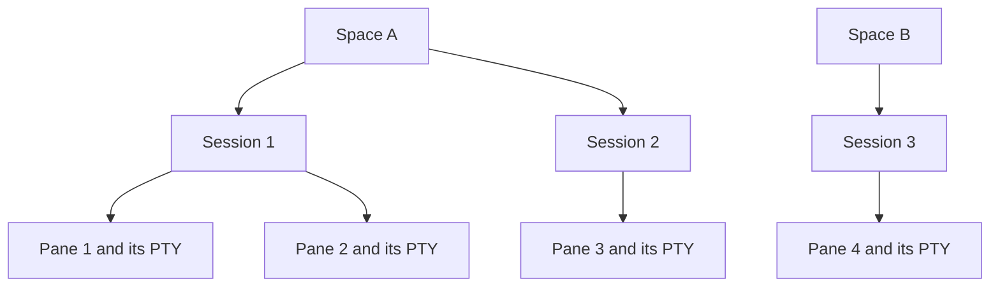

# Give each Space exclusive session ownership

Status: Product requirements confirmed by Brandan on 2026-09-10.
Implemented for package 0.1.304. Functional checks cover ownership, window
isolation, running moves, empty views, and live pane names. Operator review
is pending. CRAP and mutation gates are deferred at the operator's request.
The fixture table below states the full contract; it is not a claim that
every interruption and race case has been exercised.

This decision supersedes shared-seat membership in
[the agent-team PRD](spaces-agent-centric-prd.md) and
[the UX recommendations](spaces-ux-best-practices.md).
It addresses [issue #366](https://github.com/brandanmajeske/Prismattyc/issues/366).

## Ownership rules

A Space owns zero or more sessions. A session belongs to at most one
Space. A pane belongs to one session and inherits that session's Space.
An unassigned session may join a Space. It must not join a second Space.
There is no cross-Space sharing option.

Space ownership is independent of visibility. Switching Spaces or closing
a viewer does not stop sessions. Two windows may view the same Space.
Windows that view different Spaces must not display or write to the same
session or PTY.

## Create and save

Select `+` to create a new Space. After you name it, open the new Space
in the initiating window with one fresh session and one shell pane.
Do not copy the current layout, scrollback, command, or session reference.
Do not replay an agent command. The previous Space keeps running.

Save updates the current Space's layout and launch metadata. Save must
not assign a session to another Space or create a second name for the
same set of live sessions. Rename changes the Space's display name and
preserves ownership. A fresh shell uses the configured default shell
and default working directory.

## Add sessions

You may create several sessions inside one Space. You may also add an
unassigned session. Reject an add when another Space owns the session.
Report the owner and direct the user to Move. Do not silently share,
clone, stop, or transfer that session.

## Move running work

| Action | Ownership change | What stays intact |
| --- | --- | --- |
| Move session to Space | Transfer the session from its source Space to the destination. | Session identity, all panes, PTYs, processes, scrollback, titles, and mailbox binding. |
| Move pane to Space | Reparent only that pane into a destination-owned session. Create a destination session when needed. | Pane identity, PTY, process, scrollback, and title. Other source panes remain in place. |

Move is one operation with a source and a destination. It must not add a
second membership and remove the first later. Validate the destination
and expected source owner before changing ownership. Concurrent requests
must not assign the same session to two Spaces.

Moving the last session leaves an empty Space. Moving the last pane must
not kill its process. Show the empty state in the source view. Do not
create a replacement shell merely to satisfy a minimum-pane rule.

Update every affected live view after a move. The source no longer shows
the moved object. The destination shows it without reopening or replaying
its command. A failed move must retain the source or report a recoverable
incomplete operation. It must never report success with two owners.

Agent mail remains bound to the session when the whole session moves.
A pane move must recheck the live mailbox endpoint. Do not rename an
agent or redirect its mail based on the destination Space's name.

## Show live session names in the chip

Show each Space's live session names inside its chip. Keep the Space name
prominent. Read session names and pane liveness from the daemon. Do not
require an optional pane title. Show each session once in saved tab order.
Remove its name when its last live pane exits or its session moves out.
Add it to the destination chip after a move.

Keep this presentation change independent of ownership. Brandan may
remove it after visual review. Clip or summarize overflow within the
chip; do not overlap adjacent chips or the close control. Preserve the
full names in the chip details. Verify several named panes, long names,
small windows, and changes while the Space is not selected.

## Resolve sessions and views

Give each Space a stable identity. Store each live session's owner in
`pmuxd`. Resolve a saved session by its identity and owner. A matching
global display name, including `default`, is insufficient for reuse.

Target Space opens at a specific window. An open in a secondary window
must not redirect the registered window. Persist view state after apply;
do not use one shared attach-tabs file as the command bus for all windows.

All writers must enforce the same rule: the host, CLI, MCP, save, add,
move, restore, and legacy import. Moving a pane must use the daemon's
existing PTY-preserving move operation, rather than close and spawn.

## Import existing Spaces

Preserve the original files before migration. Detect repeated session
references across legacy files. A running session can be retained by
only one Space. Do not guess its owner from file order or the `default`
name. Report ambiguous ownership for resolution.

Other Spaces need separate sessions. A fresh shell is not a clone of a
running process or an agent conversation. Never replay a saved command
to hide a failed ownership migration. Old clients that cannot enforce
ownership must not silently use the shared-session fallback.

## Verify the contract

Use private daemon sockets, displays, configuration, and data directories.
Keep the operator's live sessions and saved Spaces untouched.

| Fixture | Required evidence |
| --- | --- |
| Create A, then B with `+` | Each Space has one distinct session, pane, PTY, and shell process. B has no A scrollback or command. |
| Add three sessions to A | All three appear in A. None appears in B. |
| Add an A-owned session to B | The operation fails with the owner. Both Spaces and the running process stay intact. |
| Type distinct markers in A and B windows | Each marker appears only in its own PTY. Space labels, session IDs, and rendered panes agree. |
| Switch A to B and back | A retains the same process and scrollback. No command launches again. |
| Open B in a secondary window | The first window retains A, its focus, and its panes. |
| Move one of A's sessions to B | Same session, pane, and process IDs. Only B owns it, including after save and reopen. |
| Move one pane from a multi-pane A session to B | Same pane and process IDs. Other A panes remain. Only the moved pane changes Space. |
| Move the last session or pane | The source becomes empty. The moved process remains alive. |
| Race two adds or moves for one session | At most one destination succeeds. Snapshot and saved ownership agree. |
| Interrupt a move or restart after save | Recovery produces one owner and an explicit outcome. No duplicate command launch. |
| Import files that all reference `default` | Ambiguity is reported. The importer never presents one PTY as several isolated Spaces. |

Inspect rendered captures as well as topology. Include negative controls
that remove the ownership check and restore the shared window target.
These controls must make the relevant fixture fail.
