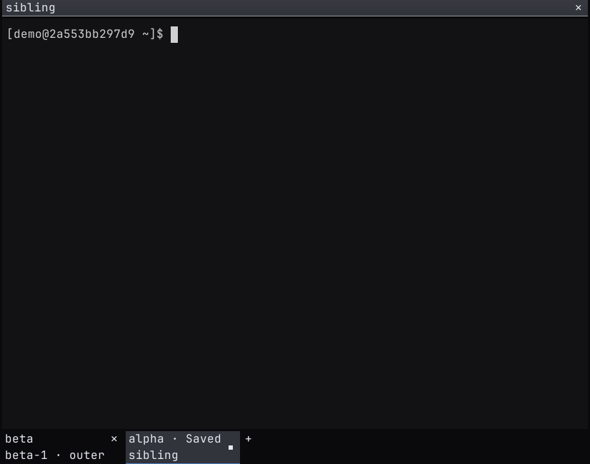
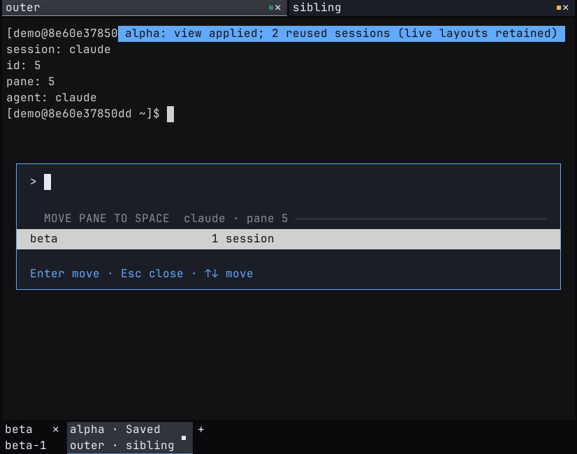
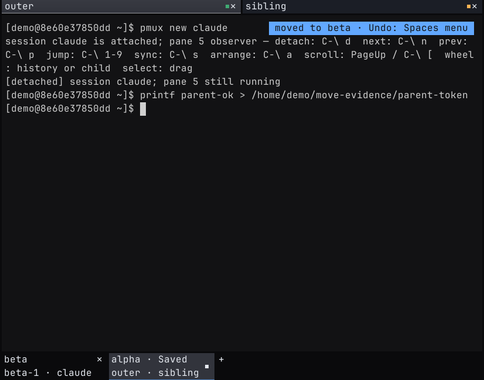

# Validate the latest Spaces changes

Code revision: `75037c4dda28347d845881c7858fbde19150f748`.
Package version: `0.1.315`.

This revision includes the [team workflows](spaces-team-workflows.md),
[Spaces controls](spaces-polish.md), [daily workflows](spaces-daily-workflows.md),
and the nested terminal move fix. Later documentation commits do not
change the tested code.

## Results

| Check | Result |
| --- | --- |
| Workspace tests | 2,079 passed |
| Workspace check | Passed with the lockfile |
| Workspace Clippy, all targets | Passed with warnings denied |
| Formatting and version checks | Passed |
| Native daily Spaces fixture | 11 checks passed against candidate binaries |
| Native nested move fixture | Five checks passed against installed binaries |
| Termwright | Six terminal scenarios passed; all 10 PNGs inspected |
| Installation | All six installed binary versions and hashes verified |

The [binary receipt](spaces-team-evidence/latest-receipt.json) records the
code revision and installed hashes. Native visual coverage is Linux X11.
Termwright covers nested terminal behavior. It does not drive the desktop
host. CRAP, mutation, and the full Local Actions merge gates were not run
for this revision. These test results do not replace those gates.

## Reproduce the nested move regression

1. Create two Spaces.
2. Open a managed shell in the first Space.
3. Run `pmux new claude` inside that shell.
4. Open the pane context menu and select **Move pane to space**.
5. Select the second Space.

The old host selected the parent pane ID. In the baseline capture, the
second Space contains `outer`; the nested Claude session did not move.

The fixed picker resolves the visible nested terminal. It displays
`claude` and its pane ID. It validates the same identity before moving.

After the move, Claude belongs to the second Space. The parent shell and
sibling remain in the first Space. The test verifies their pane and process
IDs. It also enters a command in the parent shell after the viewer detaches.

The fixture also checks a target that exits, nested focus that changes
while the picker is open, session switching inside an existing attach,
and an ordinary managed pane move. A CLI test verifies that Undo releases
a newly assigned session without changing its process.

## Upgrade an existing window

Reopen Prismattyc to load the new host. Detach and reattach an existing
nested viewer from 0.1.314 or earlier once. Older viewers do not report their
live pane identity. The host refuses a move when it cannot identify the
visible terminal. You do not need to restart `pmuxd`.
