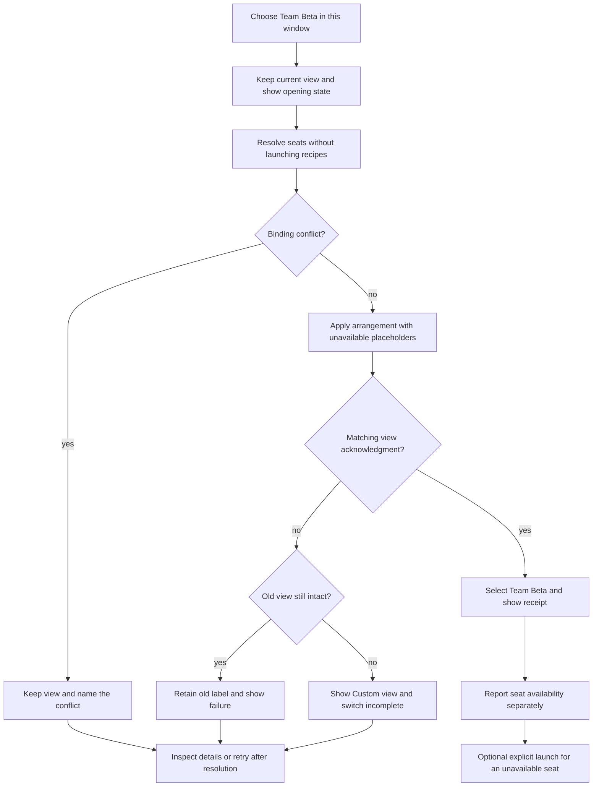
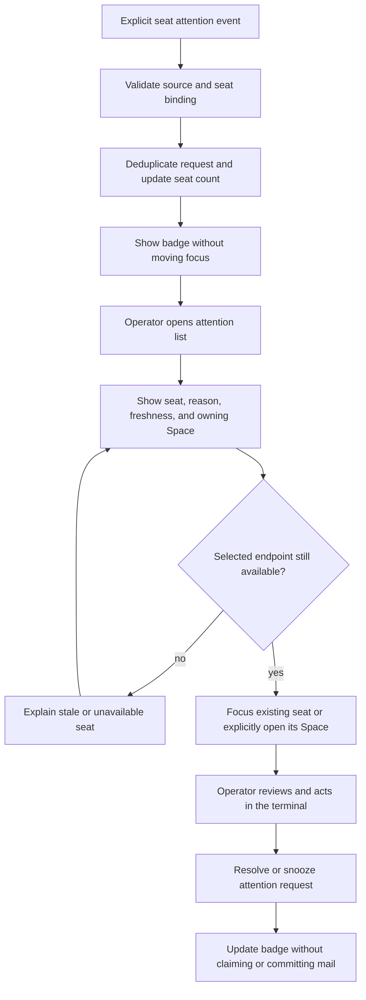

# Apply workspace UX patterns to Spaces

The [2026-09-11 decision](spaces-team-workflows.md) records the accepted
implementation scope and the retired seat-model proposal. Treat the
recommendations below as historical research.

The [exclusive ownership decision](spaces-exclusive-ownership.md), confirmed
by Brandan on 2026-09-10, supersedes the shared-seat recommendations below.
Each Space owns its sessions. Add cannot share a session across Spaces.
Move transfers ownership and preserves the running process.

| Field | Value |
| --- | --- |
| Status | Research and proposed interactions. No runtime change. |
| Reviewed | 2026-09-09 |
| Scope | Companion to the [Spaces agent-team PRD](spaces-agent-centric-prd.md), PR #337, under #321 item 6. |
| Evidence | Primary product documentation and official release notes. Products were not installed or usability-tested for this review. |

Spaces should help you answer three questions: which team am I viewing,
which seats remain available, and who needs me? Keep classic terminal
panes, the Space rail, and existing chrome as the surface.

These recommendations are design inferences from the cited patterns and
Prismattyc's code analysis. A documented feature establishes a pattern,
not its effectiveness for our users. Retain the PRD's measurement and
independent-user validation gates.

## Compare relevant patterns

The final column proposes an application to Spaces. It does not claim
that the named product implements our requirement.

| Product or pattern | Verified behavior | Application and boundary |
| --- | --- | --- |
| tmux sessions | Clients attach to named sessions; detaching leaves programs running. [Getting Started](https://github.com/tmux/tmux/wiki/Getting-Started) | Preserve seats when views change (S-03). Keep named targets in the TTY (S-08, S-09). A visual group must not own process lifetime. |
| Zellij resurrection | Exited sessions are discoverable separately. Saved layouts and commands can be recreated; immediate execution has an explicit force-run option. [Session resurrection](https://zellij.dev/documentation/session-resurrection.html) | Distinguish live seats, recipes, and placeholders (S-05, S-07). Recreating a command does not recover its process. |
| VS Code multi-root workspaces | Workspace files group folders; folder and workspace settings have different scopes. [Multi-root workspaces](https://code.visualstudio.com/docs/editing/workspaces/multi-root-workspaces) | Make membership and scope visible (S-13, S-16). Folders are not agents or isolation boundaries. |
| Cursor workspaces and agents | Official release notes document multi-root code context. Current worktree docs describe isolated checkouts for agent tasks; the Agents Window manages multiple agents. [Multi-root release](https://cursor.com/en-US/changelog/0-50), [worktrees](https://cursor.com/docs/configuration/worktrees), [multi-agent overview](https://cursor.com/help/ai-features/multi-agent) | Distinguish seat, repository, and worktree identities (S-04, S-16). Borrow agent navigation, not orchestration. Do not assume parity across Cursor surfaces. |
| JetBrains project windows | IntelliJ IDEA offers current-window, new-window, and ask behavior. Startup reopening is configurable. [Open and reopen projects](https://www.jetbrains.com/help/idea/open-close-and-move-projects.html) | Make the target window explicit (S-08). Preserve our decided cold-start question (S-05), rather than copying another startup default. |
| iTerm2 arrangements and restoration | Arrangements can restore into a specified window or new windows. Restoration reconnects surviving servers and distinguishes restored contents from jobs; processes do not survive reboot. [Arrangement API](https://iterm2.com/python-api/arrangement.html), [session restoration](https://iterm2.com/documentation-restoration.html) | Separate arrangement, connection, and process results (S-01, S-05). A familiar layout cannot certify a live team. |
| Chrome saved tab groups | Named groups can close while remaining saved for reopening. Removing a tab from a group is a separate action. [Desktop tab groups](https://support.google.com/chrome/answer/2391819?hl=en-GB) | Separate leaving a view, removing membership, deleting a definition, and stopping a seat (S-03, S-13). Browser closure does not establish PTY survival. |
| Linear team home and Inbox | Team home collects resources and common views. Inbox separates priority updates and supports snooze and grouping. [Teams](https://linear.app/docs/teams), [Inbox](https://linear.app/docs/inbox) | Put a few context links near seats (S-16). Make attention actionable (S-10, S-12). Do not copy issue workflows or equate notice dismissal with mail commit. |
| Notion teamspaces | Users prioritize, collapse, and favorite relevant content. Content can remain linked across teamspaces. [Sidebar and teamspaces](https://www.notion.com/help/guides/structure-sidebar-focused-work-teamspaces) | Make relevant Spaces easy to find. Apply navigation ideas only; Space sessions have exclusive ownership (S-13). Avoid an ever-growing permanent sidebar. |
| OpenHands | Cloud UI offers repository selection and recent conversations. The SDK supplies explicit execution states; idle is not completion. [Cloud UI](https://docs.openhands.dev/openhands/usage/cloud/cloud-ui), [conversation API](https://docs.openhands.dev/sdk/api-reference/openhands.sdk.conversation) | Use reported state and its source (S-10, S-12). The local GUI page appears under “Deprecated Projects”; treat it as historical dashboard evidence. [GUI server documentation](https://docs.openhands.dev/openhands/usage/cli/gui-server) |
| Aider in terminal panes | Aider can notify when a response finishes and awaits input. Its FAQ limits an instance to one repository, with read-only context options for others. [Notifications](https://aider.chat/docs/usage/notifications.html), [FAQ](https://aider.chat/docs/faq.html) | Use explicit readiness signals (S-11, S-12). “Aider-style multi-pane” is an operator composition, not a verified built-in team dashboard. |
| Claude computer use | The application executes desktop actions and returns observations in an agent/tool loop. [Computer use](https://platform.claude.com/docs/en/agents-and-tools/tool-use/computer-use-tool) | Distinguish requested actions from observed outcomes (S-01, S-12). This is not a workspace manager. Screenshots and tool requests do not establish task completion. |

VS Code's workspace trust separates browsing unfamiliar content from
automatic execution. Apply that distinction to imported launch recipes,
without adding confirmation to ordinary Space navigation.
[Workspace trust](https://code.visualstudio.com/docs/editing/workspaces/workspace-trust)

W3C's status-message guidance favors announcing updates without moving
focus unnecessarily. Apply the principle through native accessibility
and TTY text. This is guidance, not a Prismattyc conformance claim.
[Status messages](https://www.w3.org/WAI/WCAG22/Understanding/status-messages.html)

## Define an honest open receipt

S-01 needs three separate results. This is the key amendment to #337.

| Dimension | Example values | What it proves |
| --- | --- | --- |
| View | Pending, applied, unchanged, incomplete, failed | Whether the arrangement reached the target view. |
| Seats | Reused, created, unavailable, binding conflict | Whether each seat resolved. Created does not prove that its agent is ready. |
| Launch | Not requested, started, failed, outcome unknown | Whether an explicit launch occurred. Started does not mean task complete. |

An applied view can contain an unavailable seat placeholder. Label it
“Team Beta open · 1 seat unavailable.” Avoid an unqualified “Team ready.”
A plain switch must not launch the missing seat. Offer a separate action
on that seat.

While opening, retain the current chip and mark the destination pending.
Select the destination only after its matching view acknowledgment.
After failure, retain the old label only if the old arrangement is intact.
Otherwise show “Custom view · switch incomplete” with recovery details.
An old label on a partially changed layout is also dishonest.

Show a short receipt near the rail. Keep details available from the Space
menu after the toast disappears. Ordinary success must not take focus or
require dismissal. Errors must name the seat, failed step, and available
recovery action. Put operation IDs and revisions in expanded diagnostics
and machine output, not the default operator flow.

CLI, TTY, and MCP must distinguish acceptance from application. A
synchronous operation must not report success on a cache write alone.
An asynchronous mode must return pending status and a queryable ID.
Freeze exit codes and protocol fields in the phase 2 ADR; none ship here.

### Recommended switch flow



For rapid A → B → C navigation, correlate each result to its request.
The latest queued intent determines the eventual destination. If B has
begun applying, finish or report it before applying C. A late B receipt
must not label a C arrangement. Superseding a view request must not kill
agents or silently cancel a launch already in progress.

## Keep attention factual and quiet

Give every badge a unit. Use “2 seats need you,” not a bare 2 that could
mean letters, tasks, or errors. Count unique seats within a Space.
Count each live seat under its owning Space. Keep unread mail separate
from requests for human attention.

| Display | Required source | Never infer it from |
| --- | --- | --- |
| Connected | Current daemon binding and live connection | A saved recipe or cached session ID. |
| Process exited | Observed process exit | Silence or stale status. |
| Needs input | Explicit agent or operator request | Elapsed time, CPU, or missing output. |
| Agent reports working | Fresh agent report, source, and update time | Terminal bytes or a running shell alone. |
| Work state unknown | No fresh supported report | A guessed success or failure. |
| 3 letters | Authoritative mail depth | Number of toasts or visible panes. |

Expired work state becomes unknown. A needs-input request remains pending
until resolved, but a disconnected or expired source must be labeled
stale and moved out of fresh urgent attention. Keep it inspectable.
Do not erase it merely because the producer stops reporting.

Coalesce repeated events for one seat and request. A new unresolved
request may notify once under the operator's preferences. Keep routine
completion quiet unless subscribed. Another Space referencing the seat
must not cause another ring. Snooze changes reminders, not mail delivery.

### Recommended attention flow



Focus an existing pane when possible. Otherwise offer to open a Space
containing that seat in this window, or reveal its existing window.
Do not create a duplicate process for navigation. Recheck the binding
at selection time so stale list entries cannot target another agent.

### Compact surface sketch

This illustrative P1 panel uses the existing Space surface. Names, counts,
and states are examples, not live readings. Default to terminal panes.
Open the panel through the rail menu or palette. Escape dismisses it and
restores prior focus.

```text
Rail: [ Team Alpha * ] [ Team Beta: 2 seats need you ] [ + ]

Team Beta                         [Open in this window] [Details]
Seat       Connection    Work / attention
builder    connected     Needs input: choose branch    [View]
reviewer   connected     Needs input: review ready      [View]
tester     unavailable   Work state unknown             [Details]

Context: [Design] [Repository]       Owner: this Space
Mail: reviewer has 3 letters         Last open: 1 seat unavailable
```

Keep text with color and symbols. Provide keyboard traversal, visible
focus, and accessible names for chips, counts, and actions. At narrow
widths, move secondary metadata into Details while retaining seat and
reason. The TTY must expose equivalent information as text and named
actions. It need not reproduce the pixels. Do not capture guest keys
while the panel is closed.

## Preserve restore, membership, and launch boundaries

Keep the shipped “Restore last space?” question and Restore / Start fresh
actions. Explain that Restore restores layout and reconnects available
seats; exited panes may need Enter to reopen. Start fresh keeps saved
definitions. Do not add a second startup dialog or imply conversation
recovery.

| Action | Scope | Required result |
| --- | --- | --- |
| Switch Space or detach view | This view | Existing seats continue running. |
| Remove seat from Space | Saved membership | The live seat stays alive and becomes unassigned. |
| Delete saved Space | Saved definition | Sessions and mail survive. Any undo restores metadata only. |
| Stop seat | Live process/session | Name the target and consequences. Do not hide it inside membership removal. |
| Launch saved recipe | Selected unavailable seat | Expose command and working directory in details; honor established launch policy. |

A seat has one owning Space, one mailbox binding, and one work state. Space names
do not establish filesystem permissions or branch ownership. Identify
whether worktree context came from live observation or saved metadata.
Importing a file must not itself authorize recipe execution. Repeated
launches still need identity and retry guarantees; a dialog cannot
substitute for them.

## Do / don't checklist

These are proposed acceptance checks, not completed runtime tests.

| Requirement | Do | Don't |
| --- | --- | --- |
| S-01 | Separate view, seat, and launch outcomes; retain details. | Treat helper exit or cache write as applied-view evidence. |
| S-02 | Select chips after apply; label incomplete layouts. | Leave old or requested labels on unrelated layouts. |
| S-03 | Preserve processes and mail across view changes. | Terminate agents when hiding their views. |
| S-04 | Check conflicts before apply and identities before navigation. | Bind by role, display name, or list position. |
| S-05 | Keep Restore / Start fresh and test both after idle. | Reopen the settled decision or auto-run recipes on Restore. |
| S-06 | Explain reused live mux layouts. | Promise that saved splits replaced an existing tree. |
| S-07 | Separate navigation from launch. | Auto-launch imported recipes or retry blindly. |
| S-08 | Name the target window or TTY view. | Switch unrelated windows through global current-Space state. |
| S-09 | Preserve legacy import and keyboard access. | Make hover the only way to discover essential state. |
| S-10 | Show seat, reason, and typed attention counts. | Replace the terminal with a permanent dashboard. |
| S-11 | Recheck endpoints; keep mail actions separate. | Claim on selection or commit on badge dismissal. |
| S-12 | Show source and freshness; deduplicate requests. | Infer working/done from silence or CPU; repeat alerts until ignored. |
| S-13 | Enforce one owning Space; transfer ownership on an explicit move. | A live session appearing in more than one Space. |
| S-14 | Expose pending and partial outcomes through CLI and MCP. | Report acceptance as completed application. |
| S-15 | Preview template seats, recipes, and conflicts. | Hide process creation inside template import. |
| S-16 | Link authoritative context and label stale metadata. | Rebuild tickets or certify ownership from a label. |

The dual-authority bus is a Prismattyc architecture risk, not a competitor
UX finding. Keep one negotiated apply path and correlated acknowledgments.
A better toast over competing cache and protocol writers would still
produce an unreliable workspace.

## What we should change in #337

The companion PRD includes these amendments on the same branch:

- Strengthen S-01 with independent view, seat, and launch results and
  receipt details available after transient feedback disappears.
- Strengthen S-02 and partial-failure handling. Retain an old label only
  for an intact old arrangement; label incomplete views explicitly.
- Extend S-10–S-12 with typed counts, deduplication, source freshness,
  and navigation that leaves mail delivery unchanged.
- Enforce S-13 with exclusive ownership and distinct add, move, remove, and stop actions.
- Strengthen S-09 and S-14 with keyboard access, accessible status,
  and explicit pending/applied parity. Keep diagnostic IDs out of the
  default operator flow.
- Use these two flows and the compact sketch as design references.
  Preserve S-05 and S-07 instead of adding startup prompts.

Implement receipt, label, and target behavior in roadmap phases 1–2.
Implement exclusive ownership before further seat and attention features. Context links
and templates retain P2 priority. This creates no parallel epic. #333 is
on main.

## Validate the recommendations

Extend existing private-window and mailbox fixtures. Cover an applied
view with an unavailable seat, partial regroup, out-of-order receipts,
and late callbacks after focus moves. Negative controls must fail when
the relevant acknowledgment or identity check is removed.

Send repeated attention events, then move the seat between two Spaces. Verify
one seat in aggregate counts, stable focus, and unchanged claim/commit
state after inspection or snooze. Expire the source and verify that its
work state is no longer fresh. Repeat navigation with only the keyboard
and inspect accessible status output.

Observe operators switching teams, finding requests, and recovering seats.
Record misroutes, accidental launches, repeated alerts, recovery steps,
completion, and time. Compare with each operator's current workflow.
Freeze targets after baseline; copying a pattern does not prove benefit.

This research does not verify competitor reliability, platform parity,
or preference rankings. OpenHands local GUI is historical in its current
documentation navigation. Cursor's multi-root release is dated 2025;
current worktree and Agents Window docs are separate evidence. Recheck
changing surfaces before later competitive claims. No runtime benchmark
or new Spaces behavior is claimed as validated here.
