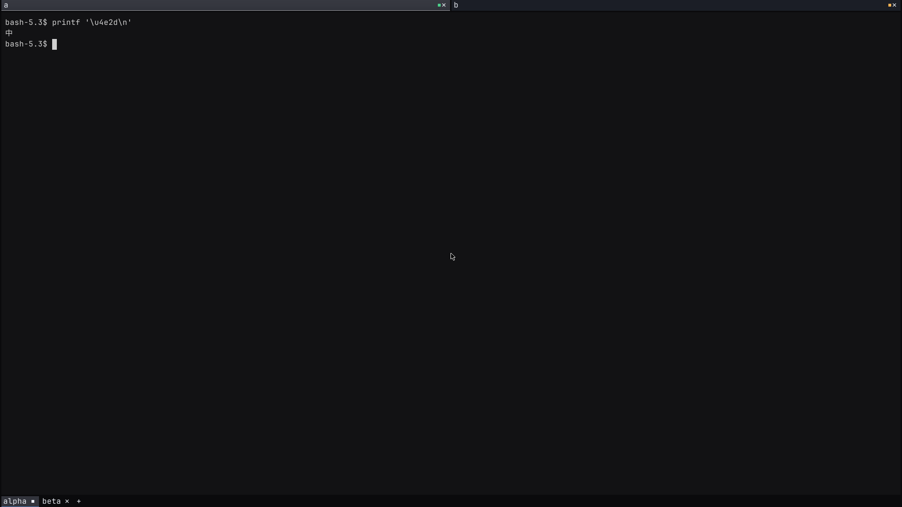

# Load fallback outlines on first use

PT-267 keeps the primary face ready for cell metrics and shaping. It records
all other outline candidates in their existing order. A candidate reads its
source on the first lookup that reaches it. It checks the character map before
it parses outlines with fontdue. It caches coverage results, parsed faces, and
load failures for the lifetime of the font configuration.

A primary glyph prevents later candidates from loading. A covered blank glyph
also ends the search. A missing glyph continues to the next candidate. The
close-tab glyph uses the same ordered lookup and retains its ink-width check.
Color emoji and system font discovery keep their existing position in the chain.

The startup log lists fallback candidates. A separate `loaded fallback` line
records each outline face when it is first parsed.

## Memory measurements

Measurements use fresh demo containers, three shell panes, 16 px text, and
at least 60 seconds of idle time after grouping the panes. The grids are 92,
45, and 45 columns by 42 rows. Both runs use the same commands and installed fonts.
The baseline is `c2cc97d146c4`, which includes the PT-262 blank-glyph fix.
The candidate is `90c062c062f5`. Later rebasing changes tests and version
metadata; it does not change the font implementation.

| Font set | Measurement | Eager baseline | Lazy candidate |
| --- | --- | ---: | ---: |
| Demo defaults | Final host RSS | 159.188 MiB | 91.320 MiB |
| Demo defaults | Tracked live heap | 131.861 MiB | 63.196 MiB |
| Demo defaults | Initial font faces and bytes | 129.554 MiB | 60.889 MiB |
| Demo plus desktop fallback files | Final host RSS | 592.281 MiB | 91.414 MiB |
| Demo plus desktop fallback files | Tracked live heap | 532.754 MiB | 63.198 MiB |
| Demo plus desktop fallback files | Initial font faces and bytes | 530.448 MiB | 60.891 MiB |

The extended pair adds copies of Adwaita Mono, Liberation Mono, Noto Sans
Symbols 2, Noto Sans Symbols, and the SC/JP/KR variable faces from the desktop.
It tests the cost of those actual files in a controlled box. It does not claim
to reproduce the desktop process or its full configuration. The candidate
loads no fallback outlines during either idle run.

[The numeric results](assets/pt267-memory.json) record exact byte counts and
sampling durations.

RSS comes from `/proc/PID/status`. Heaptrack records live allocations at
SIGTERM after the idle sample. Its `leaked` flamegraph export means retained
allocations at that endpoint. It does not establish a leak. RSS includes more
than tracked allocations, so RSS and live heap need not match.
Each font set has one matched pair. This is not a statistical estimate across
machines.

## Cost of individual faces

A separate Linux probe loads each font in a fresh process. It measures glibc
`mallinfo2().uordblks + hblkhd` before loading and after parsing. It drops the raw
file buffer before the final measurement. These figures include allocator
accounting overhead. They are not interchangeable with heaptrack payload bytes.

| Face | Parsed allocation increase |
| --- | ---: |
| Bundled JetBrains Mono Nerd Font | 47.959 MiB |
| Bundled DejaVu Sans Mono | 9.005 MiB |
| Bundled Noto Sans Symbols 2 | 12.236 MiB |
| Installed JetBrains Mono Nerd Font | 46.590 MiB |
| Adwaita Mono | 19.050 MiB |
| Liberation Mono | 6.474 MiB |
| Installed Noto Sans Symbols 2 | 11.478 MiB |
| Installed Noto Sans Symbols | 3.485 MiB |
| Noto Sans SC variable | 171.004 MiB |
| Noto Sans JP variable | 88.010 MiB |
| Noto Sans KR variable | 103.953 MiB |

The installed and bundled faces can differ. A filename match does not prove
that two files contain the same font. The implementation preserves both
candidates and their order.

## Verify first use

The host regressions compare the lazy symbol raster with an eagerly parsed
reference face. They cover primary and fallback blanks, missing characters,
invalid sources, ordering, and reuse. The spaces box test adds an installed CJK
face to the candidate chain. It checks that ASCII startup does not parse that
face. It then prints U+4E2D and requires the first-load log entry. The rendered
screenshot shows the Chinese character in the pane.

The initial load cost moves to the first character that needs a fallback.
Fallback source bytes remain available for coverage lookup. Workloads that use
many faces can still load many outlines. The idle saving is not a byte limit on
all future font activity.
