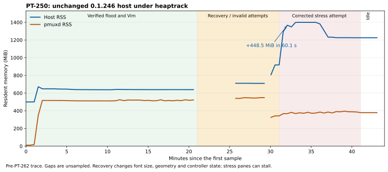

# Measure host memory use (PT-250)

This investigation measures release `7fad623` (`0.1.246`) on Linux x86_64.
It separates the host process from `pmuxd`. The reported desktop symptom is
about 1.4 GB of host RSS after about 1.6 hours with three attach panes
in the desktop host then in use. Its running binary version was not
established.

## Attribute the 448.5 MiB increase

Between 21:31:41 and 21:32:41 UTC, host RSS increases from 918.9 to
1367.4 MiB. Live allocations below `attach_log::Client::read_frame` grow
by 393.471 MiB. This is 87.7% of the 448.504 MiB RSS increase.
Fonts, screen rows, and damage allocations remain flat during this minute.

| Allocation owner | Before (MiB) | After (MiB) | Increase (MiB) |
| --- | ---: | ---: | ---: |
| Deserialized `PaneEvent` payloads | 20.167 | 377.667 | 357.500 |
| Deserialized response batch storage | 0.241 | 30.522 | 30.281 |
| Frame read buffers | 11.553 | 17.243 | 5.690 |
| Other attach allocations | 0.081 | 0.081 | 0 |
| All attach-reader allocations | 32.043 | 425.514 | 393.471 |
| Total tracked live heap | 304.784 | 698.283 | 393.499 |
| Host RSS | 918.852 | 1367.355 | 448.504 |

The remaining 55.005 MiB of RSS growth is not explained by net tracked
live allocations. RSS includes allocator retention, profiler overhead,
and mappings. This experiment does not split that remainder by owner.
It does not justify assigning all of it to a leak or to fragmentation.

The source bounds the attach channel by 256 messages per pane. Each
`LogMessage::Events` message owns a batch of frames. The host now reserves
encoded response bytes before it enqueues each message. The reservation
blocks the reader when the per-stream budget is full. It preserves event
ordering and sequence recovery. `Client::read_frame` still owns its JSON line
and the deserialized response during a read, so the budget is an admission
bound rather than a total-process memory limit.

After the commands finish and two minutes pass without input, attach
allocations fall to 0.200 MiB. Total tracked live heap is 273.028 MiB,
while host RSS remains 1225.809 MiB. The trace records a transient backlog
and a large persistent RSS gap. It does not show a monotonic ownership leak.
A repeat without heaptrack is needed to separate allocator behavior from
profiler overhead in that final gap.



The trace predates PT-262. It also includes the recovery and geometry
changes described below. It reproduces large RSS under instrumented stress,
not uninterrupted three-pane rendering or a current-main acceptance pass.

## Account for startup fonts

The startup profile identifies an unnecessary system-font load. Painting
U+0020 in the footer loads `NotoSansCJK-Regular.ttc#0`. The primary face
already covers space. Its empty bitmap triggers fallback lookup.

A completed 60-second startup profile retains 298.75 MiB in that system
font. This is 61.2% of the host's 487.77 MiB RSS at the final idle sample.
The font remains owned by `FontMetrics::fallback_fonts`. This allocation
is font outline data, not a glyph bitmap atlas.

[PT-262 / PR #274](https://github.com/brandanmajeske/Prismattyc/pull/274)
merged as `c2cc97d` (`0.1.247`). It fixes covered blank glyphs and stops whitespace before fallback lookup.
The fresh-box pair uses the same three-pane startup actions, installed
fonts, release profile, one-CPU limit, and 2 GiB container memory limit.
RSS after setup falls from 496.7 MiB to 160.8 MiB. The fixed binary is
`21dd3c7` (`0.1.247`). Both new regressions fail before the fix and pass
after it. CJK and emoji rendering tests still pass. The reviewer also
reproduced unwanted font-cache population with a deterministic space test.
Their short idle A/B did not reproduce the large RSS delta. The selected
face, startup actions, and installed fonts affect the memory cost.

The unchanged host stabilizes near 639 MiB after the verified flood and
Vim phases. The measured initial chain is system JetBrains Mono Nerd Font,
bundled JetBrains Mono Nerd Font, bundled DejaVu Sans Mono, and bundled
Noto Sans Symbols 2. Noto Color Emoji contributes owned font bytes.
This box does not eagerly load Noto Sans SC, JP, or KR. The owner's desktop
has a different installed-font set; do not transfer this chain's cost
without measuring that chain. PT-267 tracks the remaining eager-font cost.

## Reproduce the measurement

1. Build the demo image with `demo/docker/run.sh build`.
2. Build the unchanged host and mux binaries with `cargo build --release
   --locked -p prismattyc-host -p prismattyc-mux`.
3. Create a disposable demo container with `docker create --init`.
4. Copy the release binaries into `/usr/local/bin` before you start it.
5. Install heaptrack, Vim, and notcurses inside the container. Refresh the
   Arch package database if its package URLs are stale.
6. Start the host under `heaptrack --record-only`. Attach three live mux
   sessions. Use host keyboard actions to move them into one tab.
7. Wait at least two seconds without input before each host-state check.
8. Sample host and daemon `status` and `smaps_rollup` every 30 seconds.
9. Record persisted pane-log file sizes and take phase screenshots.
10. Run the workload sequence below. Analyze the completed heaptrack file.

Artifacts are in `/home/brandan/.cache/prismattyc/pt250/`. Targets are in
`/home/brandan/.cache/prismattyc/targets/pt250/`. The desktop daemon and
its sessions are not part of the experiment.

| Setting | Value |
| --- | --- |
| Host source | `7fad623`, release `0.1.246` |
| Container | `pt250-measure`, Arch, Xvfb, Openbox |
| Long-run limits | 3 CPUs, 5 GiB RAM, no swap allowance |
| Pane geometry | 92 × 42, 45 × 42, 45 × 42 |
| Font | JetBrains Mono Nerd Font, 16 px, 10 × 23 px cells |
| History limit | 10,000 rows per host pane |
| Wallpaper / GPU | No wallpaper configured; default CPU/softbuffer path |
| Profiler | heaptrack 1.5.0; RSS includes profiler overhead |
| Samples | `samples.jsonl`; KiB from procfs, converted to MiB below |
| Workload drivers | `measure.py`, then `resume.py`, `resume2.py`, and `resume3.py`; no product source instrumentation |

## Attribute the startup footprint

The completed short profiles stop the host with SIGTERM. The profiler's
`leaked` stack export therefore represents allocations still live when
sampling ends. It does not establish an ownership leak. Sum each stack
once. Do not sum the independent peaks printed for each allocation site.

| Retained heap after 60 seconds idle | Unchanged | PT-262 fix |
| --- | ---: | ---: |
| Initial font faces and owned bytes | 129.55 MiB | 129.55 MiB |
| System font loaded while painting space | 298.75 MiB | 0 MiB |
| Attach reader allocations | 0.081 MiB | 0.081 MiB |
| Grid damage allocations | 992 bytes | 992 bytes |
| Other tracked allocations | 2.23 MiB | 2.22 MiB |
| Total tracked live heap | 430.61 MiB | 131.86 MiB |
| RSS at the final idle sample | 487.77 MiB | 155.09 MiB |

RSS also includes mappings, shared display buffers, allocator retention,
and profiler overhead. Tracked heap and RSS are different measures.
No wallpaper layer is allocated in this configuration. Softbuffer display
memory is outside the heap allocation table.

The initial source-free control makes the CJK font unavailable while
keeping the binary unchanged. Idle RSS is 218.1–218.2 MiB. It still loads
`JetBrainsMonoNLNerdFont-Regular.ttf` for U+0020. The fix avoids both
unnecessary loads. It reaches a lower footprint with CJK installed.

The source confirms the allocation path in
[`paint_char_at`](../crates/prismattyc-host/src/raster.rs) and
`paint_system_outline`. The unchanged log records the exact codepoint and
font. The completed profile places the allocations below
`rasterize_footer → paint_char_at → fontdue::Font::from_bytes`.

## Explain the cell size

A small Rust probe links to the unchanged release `prismattyc-core` crate.
It calls `size_of` on the real types. These are measured layout sizes,
not estimates from serialized JSON.

| Cell field | Bytes |
| --- | ---: |
| Character | 4 |
| Style | 17 |
| Wide continuation flag | 1 |
| Optional hyperlink handle | 8 |
| Twelve inline combining characters | 48 |
| Combining-character count | 1 |
| Alignment padding | 1 |
| Total | 80 |

The combining array occupies 60% of every cell, including blank and ASCII
cells. Padding accounts for only one byte. The main cost is fixed storage,
not a large enum variant. The optional 32-bit hyperlink handle uses eight
bytes, including its option discriminant. Color uses four bytes.

At this run's widths, full history cell storage is
`80 × 10,000 × (92 + 45 + 45) = 145,600,000` bytes, or 138.9 MiB.
At 189 columns, one pane needs 144.2 MiB and three need 432.6 MiB.
These figures exclude row allocation metadata and viewport cells.

A separate follow-up should use a byte budget for history and evaluate
compact grapheme storage. It must preserve supported Unicode clusters,
hyperlinks, selection, reflow, and state import/export. The follow-up is PT-263 (p2).

## Record the long workload

The driver idles for one minute, runs `seq 1 5000000` in each pane,
observes for ten minutes, runs real Vim sessions for ten minutes, runs
notcurses for ten minutes, then idles for two minutes. It verifies that
all three floods finish before starting Vim. Each workload has a distinct
phase label in the samples. The flood observation phase includes idle time
after the finite commands finish.

The verified fixed-geometry phases use 16 px text:

| Phase | Sample interval | Host RSS range | Last host RSS | Last daemon RSS |
| --- | --- | ---: | ---: | ---: |
| Initial idle | 0–30 s | 499.9 MiB | 499.9 MiB | 10.9 MiB |
| Finite flood and observation | 60–630 s | 500.2–671.9 MiB | 637.7 MiB | 511.6 MiB |
| Vim | 661–1233 s | 639.1–641.2 MiB | 639.1 MiB | 522.3 MiB |

All three flood completion markers exist. Screenshots confirm Vim in all
three panes. The driver scrolls the focused Vim pane every 30 seconds.
Host RSS increases about 139 MiB from initial idle to the end of Vim.
A trace prefix at 1255.306 seconds of process runtime confirms 138.855 MiB
allocated below `Screen::line_feed`. History resize accounts for another
0.583 MiB. This supports the cell-size estimate with allocation evidence.

| Live heap at the end of Vim | MiB |
| --- | ---: |
| Initial font faces and bytes | 129.554 |
| Unnecessary system font face | 298.750 |
| Rows allocated by `Screen::line_feed` | 138.855 |
| Rows allocated during resize | 0.583 |
| Other screen state | 1.305 |
| Attach reader and queue | 0.081 |
| Grid damage | 0.001 |
| Other | 0.956 |
| Total | 570.085 |

This trace predates PT-262. The 298.750 MiB system-font component is
already fixed on main for this blank-space case. It is not evidence of a
remaining current-main regression. The host damage queues are negligible
at this sample. The daemon has a separate footprint and is not profiled by
this host heap trace.

The persisted pane-log JSON grows from 91,518 to 51,502,816 bytes during
these phases. File size is not resident memory. This is a serialized log
with metadata, not the daemon's raw payload budget.

### Limits of the notcurses phase

The initial notcurses attempt is invalid as a three-pane rendering test.
Two panes have 45 columns. The demo requires at least 76 columns. The
92-column pane reports `subscribe stream ended: EOF while parsing a string
at line 1 column 109632`. The reviewer tracks this subscriber failure
separately. It does not establish a memory leak.

The input driver also stops after a lease refusal. Samples are absent
between elapsed 1233 and 1544 seconds. The host and heaptrack processes
continue through this gap. Two recovery scripts preserve the original
processes. Their source and timestamps remain with the artifacts.

At about 29 minutes, a config reload requests 8 px text. The host clamps it
to 10 px and changes pane geometry to 155 × 67, 76 × 67, and 76 × 67.
This reload replaces font state and reflows history. It prevents a direct
comparison with the earlier fixed-geometry phases.

The corrected workload uses `notcurses-demo -c -d 0.1 gbh` for its grid,
box, and high-contrast demos. A first keyboard injection loses characters
under load. Direct `pmux send --force` starts three verified demo processes
at 21:31:38–40 UTC. This also changes controller state. Screenshots show
rendering and stale panes, so the attempt does not prove uninterrupted
three-pane rendering. Do not claim this as a clean notcurses acceptance
pass. No product code is changed to help the measurement.

All three corrected completion markers exist. The last sample is at
2584.58 seconds, or 43.08 minutes after sampling starts. The maximum sampled
host RSS is 1399.984 MiB. Final host RSS is 1225.809 MiB. The daemon ends
at 378.7 MiB; its allocations require a separate profile.

The completed heaptrack stream covers 2606.054 seconds. Its tracked heap
peak is about 819.2 MiB. The export records 587,711,717 allocation calls.
At shutdown, the remaining heap is mostly 129.554 MiB in initial fonts
and 138.935 MiB in row storage. Attach allocations are 0.200 MiB and
tracked damage is 0.003 MiB.

## Test allocator retention without heaptrack

A separate control uses the same unchanged release binary without
heaptrack. It uses fresh sessions and the same initial and resized pane
geometries. The shortened sequence has 20 seconds of idle, the same three
finite floods, about 20 seconds of Vim, 120 seconds of the same notcurses
demos, and 30 seconds of final idle. Files trigger each phase. No key
injection is needed between workloads. A screenshot confirms all three
notcurses panes render.

The control wrapper uses `timeout --foreground -k 2` so Vim and notcurses
retain access to their controlling terminals. An earlier attempt without
`--foreground` stopped in Vim and is excluded from the results.

At final idle, a debugger calls `malloc_trim(0)` in the disposable host.
The call returns 1. RSS immediately falls from 774.938 to 521.293 MiB,
releasing 253.645 MiB. This directly demonstrates reclaimable glibc
retention in this control. It does not prove that the whole 952.8 MiB
RSS-versus-live-heap gap in the long trace has the same cause.

The short control peaks at 779.113 MiB. This is below the instrumented
run's peak, but the dwell times, input recovery, and subscription state
differ. Do not call their entire RSS difference heaptrack memory overhead.
Instrumentation can also slow consumption and increase event backlog.
A matched short control sets `MALLOC_ARENA_MAX=2` on the host only.
Both debugger calls return 1:

| Unprofiled control | Peak RSS | Before trim | After trim | Reclaimed |
| --- | ---: | ---: | ---: | ---: |
| Default arenas | 779.113 MiB | 774.938 MiB | 521.293 MiB | 253.645 MiB |
| Two arenas | 778.660 MiB | 741.289 MiB | 487.941 MiB | 253.348 MiB |

Two arenas do not remove the retention in this pair. Peak RSS is similar,
and each trim releases about 253 MiB. The final values differ by about
33 MiB. One pair under concurrent build load is not enough to attribute
that difference solely to the arena setting or to recommend an allocator
change.

## Follow up on measured costs

| Ticket | Scope | Owner |
| --- | --- | --- |
| PT-262 | Covered blank glyph fallback; fixed by PR #274 | Complete |
| PT-263 | Scrollback byte budget and compact combining storage | codex-pc |
| PT-265 | Subscriber EOF and sequence recovery | kiro-pc |
| PT-267 | Measure and reduce the eager font chain | codex-pc |
| PT-268 | Bound attach event bytes with backpressure; p1 | kiro-pc |
| PT-269 | Evaluate trim on an idle transition, after PT-268 | codex-pc |
| PT-270 | Fix the unrelated release-suite foreground-hook test | grok-pc |

Reduce attach backlog peaks before considering idle trim. Keep trim off
the paint path. Measure each installed font face before selecting a lazy
loading or deduplication change. Keep the desktop and demo font sets separate.

The PT-249 test review also runs the mux library suite. The standard debug
suite passes 374 tests. The release suite passes 373 and fails the existing
`live_command_records_foreground_via_test_hook` test, which expects an
environment override that release code intentionally ignores. PT-270 tracks
that test mismatch. It does not invalidate the release memory measurements.

## Inspect the evidence

The repository includes the [numeric snapshot data](assets/pt250-memory.json)
and the RSS chart. Full artifacts remain in the cache directory above.
They include phase screenshots, completion markers, raw procfs samples,
the exact drivers, and the completed `host.heaptrack.zst` stream.

The minute comparison uses whole-record prefixes of that stream. It does
not restart the host or add measurement hooks. `snapshot-prefix-chunks.py`
closes gzip files before the first heaptrack timestamp beyond each target.
`heaptrack_print --flamegraph-cost-type leaked` then exports the live
allocations at each prefix boundary. Here, “leaked” means live at the
prefix end, not an established leak. The two boundaries are 1886.695 and
1946.739 seconds in the trace. Alignment to procfs samples uses the process
start time; allow about one second for clock and sampling offsets.

Classify every stack once. Match `FontMetrics::load_with` for initial
fonts, `paint_char_at → Font::from_bytes` for system fonts, and
`attach_log` for the reader-and-queue path. Split the latter by
`PaneEvent::deserialize`, response deserialization, and frame reading.
Use `Screen::line_feed`, resize, and damage stacks for screen storage.
Keep an “other” category so totals reconcile.

```bash
heaptrack_print -f rss-jump-before.heaptrack.gz -a 0 -T 0 -p 0 \
  -F rss-jump-before.stacks --flamegraph-cost-type leaked
heaptrack_print -f rss-jump-after.heaptrack.gz -a 0 -T 0 -p 0 \
  -F rss-jump-after.stacks --flamegraph-cost-type leaked
```

The trace and prefix exports parse successfully. The completed stream
also passes `zstd -t`. Do not sum independent allocation-site peaks;
the tables compare live bytes at specific times.


## Run the PT-268 flood mechanism box

Run the local mechanism box from the repository root.

```bash
./demo/docker/run.sh pt268-flood-box
```

The command uses release `prismattyc-host` and `pmux` binaries. It creates
eight real mux sessions. It attaches all eight sessions to one real host event
loop. It also creates one idle observer session and verifies a real
`pmux-attach` child starts before each flood. Each flood session runs a
60-second alternate-screen flood with 189 columns and 44 rows. Each session
starts four direct output writers. Each writer emits bursts of 64 writes.
Each write emits one 189 × 44 frame. Each session also starts one persistent
status client. This is the named producer rate. It follows the PT-250
producer-faster-than-consumer shape without a host slowdown hook, a drain
sleep, or a synthetic consumer.

The host publishes exact attach-reader metrics in `pmux render-status --json`.
Each pane reports its reader queue bytes, high-water bytes, budget, blocked
milliseconds, coalesced frames, and dropped frames and bytes. The top-level
`attach_queue` object reports the aggregate across all attached panes.

The budget-disabled run must exceed one 8 MiB per-stream budget in aggregate
reader-queue high-water. The second result proves that removing the
per-stream budget permits aggregate queue growth beyond one stream's bound.
The script prints both `RESULT:` lines.

The script also records heaptrack peaks and the same-image startup baseline.
Those heap values are informational. They are not acceptance criteria because
allocator retention and render work make process-heap deltas unstable at this
scale. The script writes heaptrack reports and procfs samples below
`$HOME/pt268-flood-box` in the demo box.

The budget override is only for the control run. Set
`PRISMATTYC_HOST_EVENT_BUDGET_BYTES=0` to remove the host admission bound.
Do not use this setting in a normal host launch.
