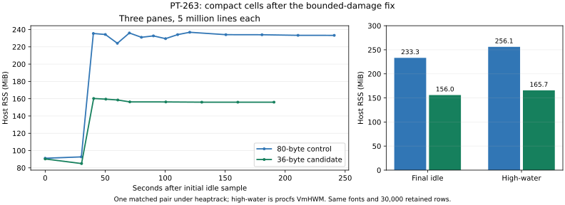
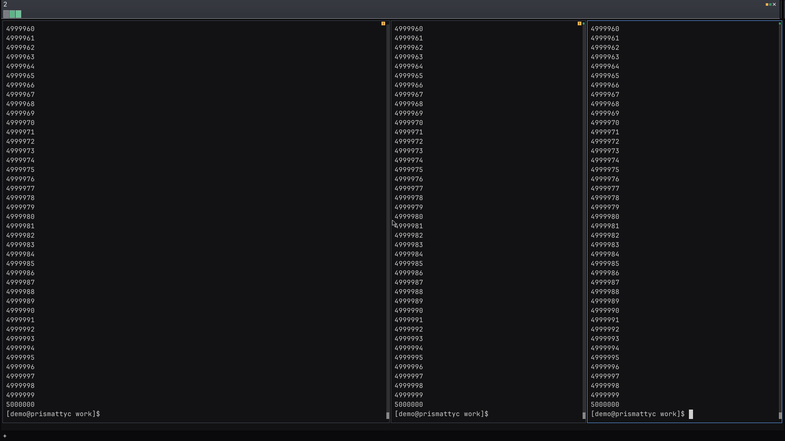
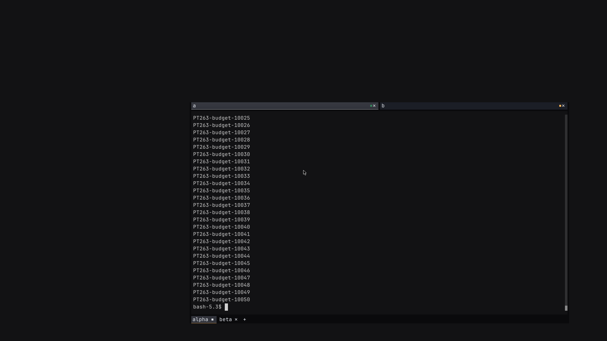

# Bound retained scrollback allocations (PT-263)

PT-263 stage two reduces `Cell` from 80 to 36 bytes on x86_64. It remains
`Copy`. Grapheme tails remain in the screen-owned store from
[stage one](scrollback-storage-pt263.md). The twelve-scalar limit and borrowed
text access do not change.

## Set the retained-row budget

Each screen defaults to a 96 MiB retained-row allocation budget. The existing
row-count limit also applies. The default retains 10,000 rows at 45, 92, 189,
and 250 columns. It evicts oldest complete rows when a wider screen or a lower
budget cannot retain that many rows.

Use `Screen::set_scrollback_byte_budget(bytes)` to change the budget. Zero
releases history and disables retention. The setter applies immediately.
Enqueue, resize, and snapshot import also enforce the budget. A screen emits
one stderr diagnostic when the byte budget first evicts before the row limit.
The diagnostic does not affect logical equality or snapshots.

`Screen::scrollback_bytes()` counts retained cell-buffer capacities and both
history deque allocations, including spare slots. Enqueue and import create
full-width rows. Resize replaces each surviving row allocation, so narrowing
releases its unused capacity. It preserves clip/pad behavior without reflow.
The byte limit applies to retained allocations after the operation. Temporary
allocations during resize or import can increase the process peak.

This is a retained-row budget, not an RSS cap. It excludes live grids,
hyperlinks, shared cluster storage, and allocator bookkeeping. The cluster
store serves both live and history cells. It retains its separate collection
policy. `Screen::cluster_storage_payload_bytes()` reports its payload-capacity
estimate, including the import cache. That estimate excludes hash-table
control bytes, unused buckets, identity control blocks, and allocator metadata.

Snapshots preserve the budget in `ScreenStateV1.max_scrollback_bytes`.
Snapshots without that field use the 96 MiB default. Import validates the
whole DTO before evicting rows. Invalid text in an old row is still rejected.
Evicted rows are skipped before persistent cluster-table import.

## Compare the same work

The control is main `1c7eb6b305e82dd3781c337ddc8d1544c1395789` (0.1.256).
It includes the [bounded scroll-damage fix](bounded-scroll-damage-pt275.md)
and keeps 80-byte cells. The candidate is
`59dade6cd0efe026e5d4c8a967d0f286cdd1d6d8`, with the same fix and 36-byte cells.
The original 0.1.254 build, `37be3ed5299d246ccfd43bab1f1e226526d3af70`,
provides a third reference arm. All arms include the completed font changes.
Use the fixed control for stage-two comparisons.

All libraries use Rust 1.96.0 and the release profile. The same
[benchmark source](../scripts/bench-cell-storage.rs) is compiled against each.
Each mode runs 200,000 rounds at 92 by 42 cells with a 10,000-row history limit.
The byte budget does not bind. All executables run in one container on CPU 23,
limited to one CPU. Five blocks rotate and reverse the order of all three arms.
No build or profiler from this investigation runs during timing.

A separate [instrumentation script](../scripts/audit-cell-storage.py) adds
counters to disposable checkouts. It counts executed grid copies, history
copies, cell assignments, cluster sets, and cache hits or misses. Instrumented
builds are excluded from the timing results. The counters cover the benchmark's
narrow ASCII bases and U+0301 workload; they are not a general terminal profiler.

All arms move 8,200,000 rows and 754,400,000 cells in every mode. The remaining
observed counts also match:

| Mode | History cells copied | Cell assignments | Cluster sets | Intern hits | Import hits / misses |
| --- | ---: | ---: | ---: | ---: | ---: |
| Scroll ASCII | 18,400,000 | 18,400,000 | 0 | 0 | 0 / 0 |
| Flood ASCII | 18,400,000 | 22,400,000 | 0 | 0 | 0 / 0 |
| Flood Unicode | 18,400,000 | 22,400,000 | 200,000 | 200,000 | 0 / 0 |
| Replica ASCII | 0 | 18,400,000 | 0 | 0 | 0 / 0 |
| Replica Unicode | 0 | 18,400,000 | 0 | 1 | 18,199,999 / 1 |

No timed-round intern misses occur. Setup prepopulates the repeated tail.
Replica Unicode keeps its source populated throughout the run. Flood cell
assignments include clearing each overwritten base before writing its glyph.
Cluster sets are counted separately.

After every audit and timed run, export the complete final DTO outside the
timed region. Remove only the new budget field, then compare SHA-256 hashes.
All arms match, including text, styles, links, wrap flags, cursor state, epochs,
and history. Flood and scroll modes retain 10,000 rows in all arms.

## Read the throughput results

| Mode | Original 0.1.254, seconds | Fixed 80-byte control, seconds | 36-byte candidate, seconds | Throughput change vs control |
| --- | ---: | ---: | ---: | ---: |
| Scroll ASCII | 1.656464 | 1.642743 | 0.771503 | +112.93% |
| Flood ASCII | 1.694879 | 1.688969 | 0.802452 | +110.48% |
| Flood Unicode | 1.728649 | 1.704145 | 0.816036 | +108.83% |
| Replica ASCII | 2.221414 | 2.215575 | 1.469558 | +50.76% |
| Replica Unicode | 2.269233 | 2.274527 | 1.504653 | +51.17% |

The table reports median elapsed time. The percentage is control time divided
by candidate time, minus one. The original and fixed 80-byte arms remain close
in these modes. The comparison attributes the reported change to stage two,
without combining it with the damage fix.

These are synthetic core workloads. They measure the same cell operations
with smaller cells. They do not predict end-to-end PTY or host paint throughput,
all Unicode workloads, or distinct-tail collection cost. Five blocked samples
per arm establish this observation; they are not a statistical equivalence test.

[The raw record](assets/pt263-stage2-throughput.json) includes all 75 timed
samples, fifteen audit runs, counters, final-state hashes, exact heads, executable
hashes, source hashes, and the container image identity.

## Compare the three-pane flood

The fixed 80-byte control and 36-byte candidate run in fresh containers from
the same profile image. Each container has three CPUs, 5 GiB RAM, no extra swap,
and a 1 GiB shared-memory allocation. The host uses the same font set and
16 px font size. Assert the actual maximized window at 1920 by 1080 pixels.
The three panes are 92 by 42, 45 by 42, and 45 by 42 cells. Each retains a
10,000-row history. No build from this investigation runs during measurement.

Run `seq 1 5000000` in every pane. Require three completion files. Wait two
minutes without input after completion. Both final screenshots show line
5,000,000 and the shell prompt in all three panes. Sample procfs for the host
and daemon separately. Both hosts run under `heaptrack --record-only`.
RSS therefore includes profiler overhead.

| Measure | Original 0.1.254 reference | Fixed 80-byte control | 36-byte candidate |
| --- | ---: | ---: | ---: |
| Host initial idle RSS, MiB | 91.309 | 91.129 | 90.285 |
| Host final idle RSS, MiB | 280.027 | 233.281 | 155.988 |
| Host high-water RSS, MiB | 329.543 | 256.090 | 165.672 |
| Daemon final idle RSS, MiB | 518.254 | 165.977 | 93.266 |
| Host tracked retained heap, MiB | 202.074 | 202.070 | 125.420 |
| Retained row cell buffers, MiB | 138.855 | 138.855 | 62.485 |
| Initial font allocations, bytes | 63,846,772 | 63,846,772 | 63,846,772 |
| Traced cluster-store allocations, bytes | 48 | 48 | 48 |

The original reference comes from the earlier run. Use the new fixed control
for the stage-two comparison. Retained row cell buffers fall by exactly 55%,
or 76.370 MiB. Both arms retain 30,000 rows across the three panes. Final host
RSS falls by 77.293 MiB (33.1%). High-water RSS falls by 90.418 MiB (35.3%).
High-water values come from procfs `VmHWM`, not the largest sampled `VmRSS`.
This is one matched pair, not an all-workload or process-memory cap claim.
Allocator retention and transient allocations also affect RSS.

The ASCII flood creates no grapheme-tail payload. The traced cluster-store
allocations are the three 16-byte identity control blocks. They are separate
from row buffers. Font allocation bytes match exactly, so the retained-row
reduction is not mixed with font changes.

An earlier compact-cell prototype exposed an unbounded scroll-damage vector.
That prototype reduced retained rows but raised peak RSS. PT-275 fixed the
vector before this comparison. See the [damage investigation and fix](bounded-scroll-damage-pt275.md).
Do not attribute its savings to cell size.

The [peak allocation record](assets/pt263-stage2-peak.json) cuts each trace at
its first maximal heaptrack `R` record. That sample occurs at 119.859 seconds
for the control and 56.610 seconds for the candidate, relative to trace start.
Damage allocations total 992 bytes in each prefix. Retained row buffers account
for 138.862 and 62.485 MiB. Attach-reader allocations account for 10.429 and
9.164 MiB. Font allocations remain equal. The old unbounded damage allocation
is absent from both peaks. Tracked allocation sizes are not resident pages;
do not add them to RSS.

[The flood record](assets/pt263-stage2-flood.json) preserves raw procfs samples,
completion records, geometry, pane grids, heap summaries, and artifact hashes.
The heap summary uses allocations still live when the host is stopped. It does
not label those allocations as ownership leaks.

| Fixed 80-byte control after flood | 36-byte candidate after flood |
| --- | --- |
|  |  |

## Measure shared cluster storage separately

[The storage probe](../scripts/measure-scrollback-budget.rs) reports actual row
allocation accounting and the separate cluster payload estimate. It runs
outside the host RSS experiment. At 45, 92, 189, and 250 columns, ASCII output
retains 10,000 rows and zero tail payload bytes. Repeated U+0301 tails retain
376 payload bytes at each width. At 1000 columns, the byte budget binds at
2794 rows and 100,653,850 retained-row bytes, below 96 MiB.

At 45 columns, 20,000 distinct four-mark tails leave a 1,654,784-byte cluster
payload estimate. After 30,000 ASCII rows replace that history, collection
reduces it to 206,848 bytes. ED3 releases it completely. A bounded residual
cache can remain until the next collection or clear, as described in stage one.
These bytes are visible in the report but are outside the retained-row budget.
[The raw storage record](assets/pt263-stage2-storage.json) includes every sample
and the emitted byte-budget diagnostic.

## Verify the retention boundary

The core suite passes 174 tests and the borrowed-view compile-fail doctest.
The emulator passes 127 unit tests and its damage, key, and snapshot suites.
The final demo-box run passes all 38 checks. It verifies Unicode export,
actual resize geometry, the fast-producer viewport, and default history depth.
The Unicode, history, and retention fixtures send complete commands to the
real shell through `pmux send`. The resize actions still use the real host
window. After five seconds without input, the retention export contains 10,026
consecutive numbered rows, from 25 through 10,050. The last 26 are live rows.

Termwright passes all six scenarios. Nine PNGs match the previously reviewed
PT-275 captures byte for byte. The changed backspace capture and all four box
captures were opened and reviewed. [The box record](assets/pt263-stage2-box.json)
contains binary identities, logs, geometry, and artifact hashes. These runs use
the candidate production code measured above. Later changes update the
acceptance driver, regression tests, and evidence only.

