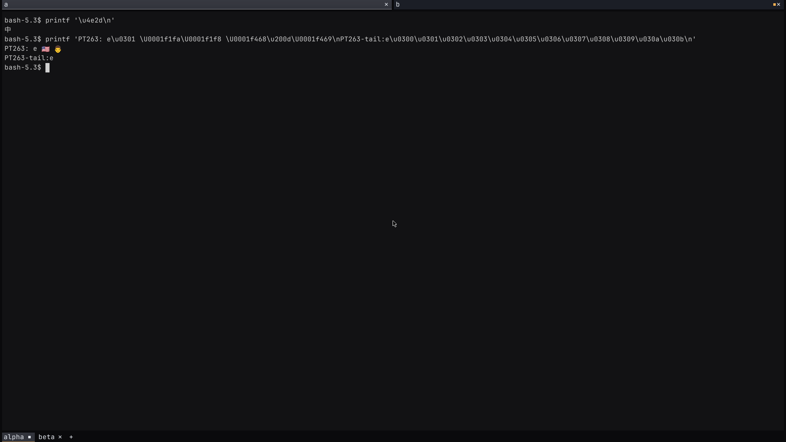

# Screen-owned grapheme storage (PT-263)

PT-263 has two stages. This stage moves trailing grapheme scalars into a
screen-owned table. It changes text access and keeps `Cell: Copy` at 80 bytes.
[Stage two](scrollback-budget-pt263.md) removes the reserved cell space and adds
a scrollback byte budget.
This stage does not reduce the scrollback cell allocation.

## Read a cell through its owner

Use `Screen::view_cell`, `Screen::history_view_cell`, or `Screen::view_row` to
read grapheme text. These methods return borrowed `CellView` values.
`CellView::combining_marks` returns all retained trailing scalars.
`CellView::write_grapheme_into` writes the base and its tail as UTF-8.
Both methods use the view's screen-owned table.

The borrow prevents mutation or destruction of the screen while a text view
remains in use. Raw `Cell` values remain available for attribute reads and grid
moves. Their handles and equality are local to one screen. Use `CellView`
equality to compare text across screens.

Each cell has a 32-bit tail handle. Zero means no tail. Three cached flags
describe regional-indicator pairing, emoji presentation, and a trailing ZWJ.
Width checks and grid moves do not read the table or update reference counts.
The table retains up to twelve trailing scalars per distinct tail. It interns
repeated tails and keeps entries immutable until collection.

## Copy and reclaim storage

| Operation | Storage rule |
| --- | --- |
| Grid scroll, insert, or delete | Copy local handles with the cells. |
| Append or demote a cluster | Intern the resulting tail and replace its handle. |
| Clone a screen | Copy the table and assign a new store identity. |
| Apply damage from another screen | Translate source handles into destination handles. |
| Export or import a snapshot | Serialize grapheme text through the existing `ScreenStateV1` DTO. |
| Collect the table | Retain tails referenced by primary, alternate, or history cells. Remap handles. |

Damage replication caches the translation from one source store. A weak identity
reference prevents address reuse from making a stale cache look valid. It does
not retain the source screen. Source cloning or collection changes that identity.
Destination collection discards the translation cache. Newly appended source
entries keep their existing handles valid.

Collection starts when the entry count reaches twice the count after the last
collection, plus 4096 entries. A new store starts with a threshold of 4096.
Large stores also collect after enough rows scroll away. The row interval is
the greater of 4096 and the current history depth plus twice the grid height.
This bounds stale storage when later output contains only ASCII. Up to 4096
cached entries can remain until another collection or a clear.

Shrinking the screen collects immediately. ED3 clears the active grid and
history, then collects. Tails still used by the other buffer remain valid.
This stage retains the existing clip/pad resize behavior. It does not add reflow.

## Measure throughput

Use [the cell-storage benchmark](../scripts/bench-cell-storage.rs) with both
checkouts. Build both core libraries in release mode. Compile the same benchmark
source against each library. Use separate target directories and preserve the
two resulting executables before changing either checkout.

Run both executables in one container pinned to one CPU. Alternate their order
between repetitions. Use the same round count for each pair. Stop your other
builds before collecting the final measurements.

| Mode | Work per round |
| --- | --- |
| `scroll-ascii` | Scroll a 92 by 42 grid with a 10,000-row history limit. |
| `flood-ascii` | Write ten ASCII characters, then scroll. |
| `flood-unicode` | Write ten ASCII characters and U+0301, then scroll. |
| `replica-ascii` | Apply one scroll event and one dirty bottom row. |
| `replica-unicode` | Apply the same damage from a source populated with combining tails. |

The replica source remains populated for every round. Unicode does not disappear
after the first viewport scroll. The benchmark checks that `Cell` remains
copyable and reports its size. Its shifted-cell rate describes this synthetic
workload. It is not a claim about end-to-end host rendering or PTY throughput.

The separate byte-budget stage must repeat throughput measurements and the
three-pane flood/RSS experiment from [the host memory report](host-memory-pt250.md).

## Stage-one measurements

The baseline is main `9fdd2f3b2c111909c1806794884e880ee95917dd`.
The candidate is `7e3815fda6979fefc8d670c8dcd7e73175cda0ea`.
Both use 80-byte cells. Both core libraries and benchmark executables were built
with Rust 1.96.0. Each mode ran for 200,000 rounds in five alternating pairs.
Both executables ran in the same container on CPU 23. No build or profiler from
this investigation ran during the measurement.

| Mode | Baseline median, seconds | Candidate median, seconds | Throughput change |
| --- | ---: | ---: | ---: |
| Scroll ASCII | 1.601579 | 1.600617 | +0.06% |
| Flood ASCII | 1.641121 | 1.640486 | +0.04% |
| Flood Unicode | 1.643678 | 1.657245 | −0.82% |
| Replica ASCII | 2.287832 | 2.215883 | +3.25% |
| Replica Unicode | 2.288340 | 2.254182 | +1.52% |

The Unicode flood is slightly slower in this sample. ASCII scrolling is nearly
unchanged, and both replica modes are faster. These measurements do not prove
statistical equivalence or predict all Unicode workloads. They cover repeated
tails. The unit tests cover reclamation under distinct tails, but do not establish
its throughput.

[The raw measurement file](assets/pt263-stage1-throughput.json) records every
sample, the image identity, both executable hashes, and the benchmark source hash.

An earlier side-store prototype interned every dirty source cell on every frame.
That version reduced Unicode replica throughput by 28.61% in three paired runs.
The retained implementation caches handle translation across frames. A separate
rejected prototype used reference-counted tails inside non-copyable cells. It
reduced cell size to 40 bytes but regressed all five measured modes by 2.8% to
16.2%. Neither rejected prototype is the implementation measured in the table.

## Check fidelity

The new real-shell steps in `demo/spaces-e2e.sh` preserve combining marks,
regional-indicator pairs, ZWJ text, and twelve-scalar tails in live and history
exports. The candidate passed 34 box checks. Termwright passed all six scenarios;
all ten PNGs were inspected.

A fresh control box used installed binaries independently checked as
`0.1.252 (9fdd2f3b2c11)`. The candidate host reported
`0.1.252 (f52001150019)`, with the same Rust implementation as the measured
`7e3815f` commit. The two output rows have zero differing pixels in the rectangle
`(0, 108)` through `(300, 153)`, with the latter corner exclusive.
[The comparison record](assets/pt263-stage1-pixels.json) identifies both heads.

This is preservation of baseline paint. In the default unshaped paint path,
`blit_cluster_in` draws the base scalar when no emoji glyph matches. Combining
accents are therefore absent in both screenshots. The export assertions prove
that the trailing scalars remain stored. The screenshots do not prove complete
combining-mark rendering.

| Main baseline | Stage-one candidate |
| --- | --- |
|  |  |
